# Сайт вальдорфской школы «Ступені» — схема автоматизации

> **Дизайн-документ · редизайн и автоматизация** · автор: Сергей Черныш · версия 0.2 · 06.10.2026
>
> **База проекта — реальная:** локальная статическая копия текущего WordPress-сайта «Ступені» (вальдорфський ліцей і дитячий садок, Одеса) в папке `D:\Site\waldorf-stupeni-school-redesign` (не git-репозиторий; копия снята 21.09.2026). Ссылки вида `file:///D:/...` открывают файлы этой папки на вашем компьютере; ссылки `https://www.waldorf-stupeni.school/...` — живые страницы. Все фрагменты кода, JSON и SQL ниже — **пример / предлагаемая структура**: нового кода пока нет. Предлагаемый технический стек — в разделе [Технологический стек](#stack).

## <a id="toc"></a>Оглавление

- [Коротко о проекте](#intro)
- [Что есть сейчас: аудит текущего сайта](#current)
- [Общая архитектура](#arch)
- [Матрица взаимодействия модулей](#matrix)
- [1. Публичный сайт (редизайн «Ступені»)](#mod-site)
- [2. Админка](#mod-admin)
- [3. Электронный журнал + «Мрія»](#mod-journal)
- [4. Агент рекламы в соцсетях](#mod-social)
- [5. Оркестратор](#mod-orch)
- [Чек-лист обязательной информации (ст. 30 + НУШ)](#compliance)
- [Сквозные сценарии](#scenarios)
  - [Сценарий А. Директор анонсирует ярмарку](#sc-fair)
  - [Сценарий Б. Учитель отмечает посещаемость](#sc-attendance)
  - [Сценарий В. Заявка родителя из Instagram](#sc-lead)
  - [Сценарий Г. Сводка к педсовету с учётом «Мрії»](#sc-mriia)
- [Роли и права доступа](#roles)
- [Приватность и закон: общие правила](#privacy)
- [Технологический стек](#stack)
- [План внедрения](#rollout)
- [Глоссарий](#glossary)

---

## <a id="intro"></a>Коротко о проекте

У «Ступенів» уже есть красивый сайт: живая шапка с цитатой Штайнера, «Ритм року» с праздниками, карусель учителей. Но он работает как витрина, застывшая в декабре 2023-го: последние новости — про Різдвяний ярмарок 2023 года, форма «Напишіть нам» в копии не отправляет письма, на сайте стоит `noindex, nofollow` (поисковики его почти не видят), а [официального блока по ст. 30](#g-art30) Закона «Про освіту» нет. Мы делаем **редизайн с автоматизацией** из пяти модулей: [публичный сайт](#mod-site) — тот же дух, но с разделом «Інформаційна відкритість» и рабочими формами; [админка](#mod-admin) — чтобы новости и документы обновляла сама школа; [электронный журнал](#mod-journal) — вальдорфский слой ([характеристики](#g-characteristic), [эпохи](#g-epoch)) поверх государственной [«Мрії»](#g-mriia), без двойного ввода; [агент рекламы в соцсетях](#mod-social) — для уже существующих Facebook, Instagram, YouTube и TikTok школы; и [оркестратор](#mod-orch) — AI-агент, который раскладывает задачу директора по модулям, спрашивает подтверждение на рискованных шагах и пишет всё в [журнал аудита](#g-audit).

**Три правила, которые проходят через весь документ:**

1. **Дети — не контент.** Фото и имена учеников появляются публично только при действующем [согласии](#g-consent) родителя. Это касается и уже опубликованных фото — их нужно проверить (см. [аудит](#cur-gaps)).
2. **Один источник правды на каждый тип данных.** Пользователи, роли и согласия — в [админке](#mod-admin); официальные оценки и посещаемость — там, где решит школа: в «Мрії» или в нашем журнале, но **не в двух местах** (см. [3.9 «Мрія»](#m3-mriia)).
3. **Всё через API.** [Оркестратор](#mod-orch) пользуется тем же API, что и люди, с теми же [правами](#roles).

[↑ к оглавлению](#toc) · [→ далее: Что есть сейчас](#current)

---

## <a id="current"></a>Что есть сейчас: аудит текущего сайта

Источник — папка-зеркало [`D:\Site\waldorf-stupeni-school-redesign`](file:///D:/Site/waldorf-stupeni-school-redesign/): её [README.md](file:///D:/Site/waldorf-stupeni-school-redesign/README.md), [catalog.json](file:///D:/Site/waldorf-stupeni-school-redesign/catalog.json) (каталог из WP REST API: **17 страниц, 5 новостей, 75 медиафайлов**), [mirror-report.json](file:///D:/Site/waldorf-stupeni-school-redesign/mirror-report.json) (**365 файлов скачано, 30 ошибок**) и документ для администрации [Informaciyna-vidkrytist-sajt-Stupeni.md](file:///D:/Site/waldorf-stupeni-school-redesign/Informaciyna-vidkrytist-sajt-Stupeni.md) (5 жовтня 2026; копия — [dlya-administracii-informaciyna-vidkrytist.md](file:///D:/Site/waldorf-stupeni-school-redesign/dlya-administracii-informaciyna-vidkrytist.md)). Визуальные свидетельства — скриншоты в `screens` и [папке «Фото сайта»](file:///D:/%D0%A4%D0%BE%D1%82%D0%BE%20%D1%81%D0%B0%D0%B9%D1%82%D0%B0/) (`D:\Фото сайта`: 26 полностраничных скриншотов главной, внутренних страниц и мобильной версии; 2 точных дубля). Локальный просмотр: [start.bat](file:///D:/Site/waldorf-stupeni-school-redesign/start.bat) → `npx serve -l 5180 .` → `http://127.0.0.1:5180/`.

### <a id="cur-tech"></a>Технически

| Что | Где в папке | Комментарий |
|---|---|---|
| Главная страница | [index.html](file:///D:/Site/waldorf-stupeni-school-redesign/index.html) | `<meta name="robots" content="noindex,nofollow">`, блоки: hero, «Чому вальдорфська школа?», «Структура школи», «Ритм року», «Наші вчителі та вихователі» (27 карточек), «Новини», «Наша школа», форма |
| Тема WordPress «Waldorf» (2023) | [wp-content/themes/waldorf/style.css](file:///D:/Site/waldorf-stupeni-school-redesign/wp-content/themes/waldorf/style.css) | ~2700 строк CSS: шрифты, «рваные» края блоков, цвета — основа для дизайн-системы редизайна |
| Карусели | [flickity.pkgd.js](file:///D:/Site/waldorf-stupeni-school-redesign/wp-content/themes/waldorf/js/flickity.pkgd.js), [fullscreen.js](file:///D:/Site/waldorf-stupeni-school-redesign/wp-content/themes/waldorf/js/fullscreen.js), [flickity.css](file:///D:/Site/waldorf-stupeni-school-redesign/wp-content/themes/waldorf/css/flickity.css) | Flickity + полноэкранный просмотр — для «Ритм року», учителей и галереи; плюс jQuery 3.7 |
| Форма «Напишіть нам» | [wp-content/plugins/contact-form-7/](file:///D:/Site/waldorf-stupeni-school-redesign/wp-content/plugins/contact-form-7/) | Contact Form 7 (`wpcf7-f254-o1`: ім'я, телефон, email, повідомлення) + reCAPTCHA. В статической копии **не отправляет**; на скриншотах виден бейдж reCAPTCHA с ошибкой ключа для localhost. Галочки согласия на обработку [ПДн](#g-pdn) нет |
| Данные WP REST API | [wp-json/index.html](file:///D:/Site/waldorf-stupeni-school-redesign/wp-json/index.html), [wp-json/wp/v2/pages/](file:///D:/Site/waldorf-stupeni-school-redesign/wp-json/wp/v2/pages/), [wp-json/wp/v2/posts/](file:///D:/Site/waldorf-stupeni-school-redesign/wp-json/wp/v2/posts/) | готовый источник для миграции контента в новую [админку](#mod-admin) |
| Дубли URL | [kindergarten/](file:///D:/Site/waldorf-stupeni-school-redesign/kindergarten/index.html) и [school-structure/kindergarten/](file:///D:/Site/waldorf-stupeni-school-redesign/school-structure/kindergarten/index.html) | одинаковые страницы ступеней по двум адресам (canonical стоит, но лучше 301-редиректы) |
| Ошибки зеркала | [mirror-report.json](file:///D:/Site/waldorf-stupeni-school-redesign/mirror-report.json) | 28 из 30 ошибок — несуществующие пути `…/r/` (артефакт относительной ссылки в теме), плюс `oembed` (400) и `xmlrpc.php` |

### <a id="cur-content"></a>Разделы и контент

| Раздел | Живая страница | Файл в копии | Состояние |
|---|---|---|---|
| Головна | [waldorf-stupeni.school](https://www.waldorf-stupeni.school/) | [index.html](file:///D:/Site/waldorf-stupeni-school-redesign/index.html) | хорошая витрина; новости на главной — **декабрь 2023** |
| Про нас | [/about-us/](https://www.waldorf-stupeni.school/about-us/) | [about-us/index.html](file:///D:/Site/waldorf-stupeni-school-redesign/about-us/index.html) | ок |
| Вальдорфська педагогіка | [/about-us/waldorf-pedagogy/](https://www.waldorf-stupeni.school/about-us/waldorf-pedagogy/) | [about-us/waldorf-pedagogy/](file:///D:/Site/waldorf-stupeni-school-redesign/about-us/waldorf-pedagogy/index.html) | ок |
| Історія школи | [/about-us/history/](https://www.waldorf-stupeni.school/about-us/history/) | [about-us/history/](file:///D:/Site/waldorf-stupeni-school-redesign/about-us/history/index.html) | ок |
| Медіа в освітньому процесі | [/about-us/media/](https://www.waldorf-stupeni.school/about-us/media/) | [about-us/media/](file:///D:/Site/waldorf-stupeni-school-redesign/about-us/media/index.html) | «безгаджетний простір» — важно для тона соцсетей |
| Правила школи | [/about-us/rules/](https://www.waldorf-stupeni.school/about-us/rules/) | [about-us/rules/](file:///D:/Site/waldorf-stupeni-school-redesign/about-us/rules/index.html) | частично закрывает «правила поведінки» (ст. 30); упоминает семестровую атестацию — пригодится [журналу](#mod-journal) |
| Методичні матеріали | [/about-us/methodical-materials/](https://www.waldorf-stupeni.school/about-us/methodical-materials/) | [about-us/methodical-materials/](file:///D:/Site/waldorf-stupeni-school-redesign/about-us/methodical-materials/index.html) | **почти пустая** страница |
| Структура школи | [/school-structure/](https://www.waldorf-stupeni.school/school-structure/) | [school-structure/](file:///D:/Site/waldorf-stupeni-school-redesign/school-structure/index.html) | дублирует тексты главной и страниц ступеней (см. §7 документа для администрации) |
| Дитячий садочок | [/school-structure/kindergarten/](https://www.waldorf-stupeni.school/school-structure/kindergarten/) | [school-structure/kindergarten/](file:///D:/Site/waldorf-stupeni-school-redesign/school-structure/kindergarten/index.html) | ок |
| Початкова / Середня / Старша школа | [/elementary-school/](https://www.waldorf-stupeni.school/school-structure/elementary-school/), [/secondary-school/](https://www.waldorf-stupeni.school/school-structure/secondary-school/), [/high-school/](https://www.waldorf-stupeni.school/school-structure/high-school/) | [elementary-school/](file:///D:/Site/waldorf-stupeni-school-redesign/school-structure/elementary-school/index.html), [secondary-school/](file:///D:/Site/waldorf-stupeni-school-redesign/school-structure/secondary-school/index.html), [high-school/](file:///D:/Site/waldorf-stupeni-school-redesign/school-structure/high-school/index.html) | ок, нет правил прийому и вартості |
| Корекційно-лікувальний блок | [/correctional-treatment-block/](https://www.waldorf-stupeni.school/school-structure/correctional-treatment-block/) | [correctional-treatment-block/](file:///D:/Site/waldorf-stupeni-school-redesign/school-structure/correctional-treatment-block/index.html) | описание есть, «умов доступності для осіб з ООП» как документа — нет |
| Семінар | [/seminar/](https://www.waldorf-stupeni.school/school-structure/seminar/) | [seminar/](file:///D:/Site/waldorf-stupeni-school-redesign/school-structure/seminar/index.html) | подготовка учителей — потенциальная «додаткова послуга» |
| Новини | [/news/](https://www.waldorf-stupeni.school/news/) | [news/index.html](file:///D:/Site/waldorf-stupeni-school-redesign/news/index.html) | 5 записей, все **8–16 грудня 2023**, напр. [Різдвяний ярмарок 16 грудня](file:///D:/Site/waldorf-stupeni-school-redesign/rizdvyanyj-yarmarok-16-grudnya/index.html), [А ваші діти читають?](file:///D:/Site/waldorf-stupeni-school-redesign/a-vashi-dity-chytayut/index.html) |
| Контакти | [/contacts/](https://www.waldorf-stupeni.school/contacts/) | [contacts/index.html](file:///D:/Site/waldorf-stupeni-school-redesign/contacts/index.html) | адрес, телефоны (офіс, бухгалтерія, вахта), 2 email, соцсети |
| Допомогти нам | [/help-us/](https://www.waldorf-stupeni.school/help-us/) | [help-us/index.html](file:///D:/Site/waldorf-stupeni-school-redesign/help-us/index.html) | «Коло друзів» — сбор поддержки; нет онлайн-оплаты и отчёта о благотворительной помощи |

### <a id="cur-shots"></a>Как сейчас: скриншоты


*Как сейчас — hero: цитата Штайнера, кнопки «Залишайтеся на зв'язку» и «Підтримайте нас», меню НА ГОЛОВНУ · ПРО НАС · СТРУКТУРА ШКОЛИ · НОВИНИ · КОНТАКТИ, соцсети FB/IG/YouTube/TikTok. На фото — десятки узнаваемых детей: нужна проверка согласий.*


*Как сейчас — «Чому вальдорфська школа?»: в тексте «ми виступаємо проти дистанційної освіти». Это позиция школы, но по ст. 30 на сайте должна быть понятная информация о [формах здобуття освіти](#compliance) — формулировку надо согласовать.*


*Как сейчас — карусель «Ритм року» (Свято врожаю, св. Михаїла, ліхтариків, різдвяна спіраль…): готовый календарь поводов для [агента соцсетей](#mod-social).*


*Как сейчас — «Наші вчителі та вихователі»: 27 карточек с ролями и стажем. Частично покрывает «кадровий склад», но не в формате ліцензійних умов.*

 

*Мобильная версия — слева: «Новини» с датами 16.12.2023, 12.12.2023, 11.12.2023 (устарели почти на три года); справа: форма «Напишіть нам» без галочки согласия на обработку ПДн.*

**Внутренние страницы** (из [папки «Фото сайта»](file:///D:/%D0%A4%D0%BE%D1%82%D0%BE%20%D1%81%D0%B0%D0%B9%D1%82%D0%B0/)):


*Как сейчас — [«Структура школи»](https://www.waldorf-stupeni.school/school-structure/): тот же групповой снимок детей, что и на главной, хлебные крошки, далее — повтор текстов ступеней с главной (дублирование из §7 документа для администрации). В углу — бейдж reCAPTCHA с ошибкой ключа.*


*Как сейчас — [«Початкова школа»](https://www.waldorf-stupeni.school/school-structure/elementary-school/): крупный план лица ребёнка в шапке страницы. Красиво, но это ровно тот случай, где нужен `photo_site` в [реестре согласий](#m2-steps). Ни правил прийому, ни вартості, ни кнопки «Записатися на екскурсію» на странице нет.*


*Как сейчас — [«Старша школа»](https://www.waldorf-stupeni.school/school-structure/high-school/): живое фото урока, текст о переходе от основного учителя к куратору. Шаблон внутренней страницы (шапка + крошки + текст) хорошо подходит для новых страниц «Вступ» и «Інформаційна відкритість».*

 

*Как сейчас — галерея «Наша школа» на главной (Flickity с полноэкранным режимом): фото здания и двора — безопасный тип контента для соцсетей.*


*Как сейчас — мобильное меню: вся текущая структура сайта; пунктов «Вступ», «Для батьків», «Інформаційна відкритість» нет.*

### <a id="cur-gaps"></a>Главные пробелы

1. **Нет раздела «Інформаційна відкритість»** — статут, ліцензії, правила прийому, вартість, булінг, форми навчання (см. [чек-лист](#compliance)).
2. **Новости не обновляются с декабря 2023** — нужна простая [админка](#mod-admin) и [агент соцсетей](#mod-social), который подсказывает поводы.
3. **Форма не работает без PHP** и не спрашивает согласия — заменить на `POST /api/public/leads` ([1.11](#m1-api)).
4. **`noindex, nofollow`** — при запуске редизайна снять, добавить sitemap и 301 с дублей.
5. **Фото детей без учёта согласий** — 75 медиа из `catalog.json` прогнать через реестр согласий ([2.6](#m2-steps)).
6. **«Методичні матеріали» пусты**, «Структура школи» дублирует главную.

[↑ к оглавлению](#toc) · [→ далее: Общая архитектура](#arch)

---

## <a id="arch"></a>Общая архитектура

Пять модулей поверх общего ядра: сервис авторизации ([JWT](#g-jwt)), база данных, очередь событий ([outbox](#g-outbox)) и хранилище файлов. Два внешних «соседа» важнее остальных: текущий **WordPress** (источник миграции контента) и государственная **[«Мрія»](#g-mriia)** (официальный электронный журнал/дневник).

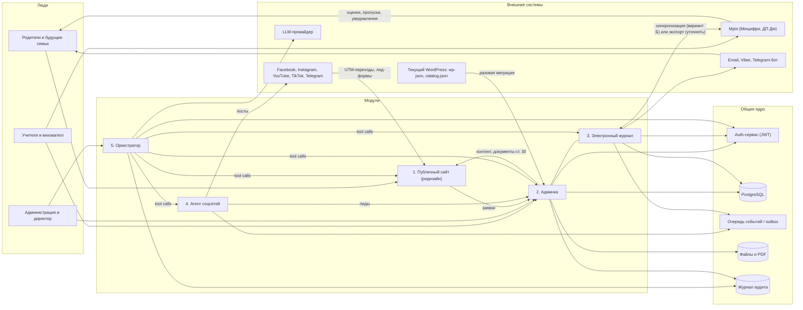

**Как читать:** стрелки — направление данных. [Оркестратор](#mod-orch) никогда не ходит в базу или в «Мрію» напрямую — только через инструменты ([tool registry](#g-tool-registry)) поверх API модулей.

[↑ к оглавлению](#toc) · [→ далее: Матрица взаимодействия](#matrix)

---

## <a id="matrix"></a>Матрица взаимодействия модулей

Строка — **кто отправляет**, столбец — **кому**. Каждая ячейка ведёт к разделу, где связь описана подробно.

| Отправитель ↓ / Получатель → | 1. Сайт | 2. Админка | 3. Журнал | 4. Соцсети | 5. Оркестратор |
|---|---|---|---|---|---|
| **1. Сайт** | — | [заявки, лиды с UTM, подписки](#m1-links) | [вход родителя → кабинет ребёнка](#m1-links) | [UTM-аналитика переходов](#m4-links) | [статус публикации](#m5-links) |
| **2. Админка** | [новости, страницы, документы ст. 30](#m2-links) | — | [ученики, классы, роли, согласия](#m2-links) | [согласия на фото, бренд-гайд, события](#m2-links) | [права, задачи на одобрение](#m5-hitl) |
| **3. Журнал** | [кабинет родителя, ссылка на «Мрію»](#m3-links) | [отчёты, сигналы «долгое отсутствие»](#m3-links) | — | [ничего — данные учеников в соцсети не уходят](#m3-risks) | [сводки, статус синхронизации с «Мрією»](#m3-mriia) |
| **4. Соцсети** | [посты со ссылками на новость/лендинг](#m4-links) | [лиды, черновики, метрики](#m4-links) | — | — | [статусы публикаций, метрики](#m4-links) |
| **5. Оркестратор** | [новость, страница события](#m5-links) | [черновики, задачи, follow-up, проверка ст. 30](#m5-links) | [чтение сводок; запись — только с подтверждением](#m5-hitl) | [кампания: черновики постов](#m5-links) | — |

[↑ к оглавлению](#toc) · [→ далее: 1. Публичный сайт](#mod-site)

---
## <a id="mod-site"></a>1. Публичный сайт (редизайн «Ступені»)

### <a id="m1-purpose"></a>1.1 Назначение

Лицо школы — **редизайн существующего сайта**, а не новый с нуля. Сохраняем то, за что сайт любят (тёплая тема «Waldorf», «Ритм року», учителя, тексты о педагогике), и добавляем то, чего не хватает: официальный раздел по [ст. 30](#g-art30), живые новости, рабочую форму заявки с согласием, кабинет родителя и индексацию в поиске.

### <a id="m1-now"></a>1.2 Что есть сейчас

Подробно — в [аудите](#current). **Какие страницы есть** (подтверждено копией сайта, [catalog.json](file:///D:/Site/waldorf-stupeni-school-redesign/catalog.json) и скриншотами из [папки «Фото сайта»](file:///D:/%D0%A4%D0%BE%D1%82%D0%BE%20%D1%81%D0%B0%D0%B9%D1%82%D0%B0/)):

| Группа | Страницы (17 + 5 новостей) | Скриншот есть |
|---|---|---|
| Головна | hero, «Чому вальдорфська школа?», «Структура школи», «Ритм року», «Наші вчителі та вихователі», «Новини», «Наша школа», «Напишіть нам» | да, десктоп и мобильная версия |
| Про нас | Вальдорфська педагогіка, Історія школи, Медіа в освітньому процесі, Правила школи, Методичні матеріали (+ якоря «Наша школа (фото)», «Наші вчителі») | меню |
| Структура школи | обзор + Дитячий садочок «Ступені», Початкова, Середня, Старша школа, Корекційно-лікувальний блок, Семінар | да, десктоп (садочок, початкова, середня, старша) и мобильная версия |
| Новини | 5 записей 8–16.12.2023 | карточки на главной |
| Прочее | Контакти, Допомогти нам | форма — мобильная версия |

Коротко о технике: 17 страниц и 5 новостей ([catalog.json](file:///D:/Site/waldorf-stupeni-school-redesign/catalog.json)), главная [index.html](file:///D:/Site/waldorf-stupeni-school-redesign/index.html) с блоками hero → «Чому вальдорфська школа?» → «Структура школи» → «Ритм року» → учителя → «Новини» → «Наша школа» → «Напишіть нам»; тема [style.css](file:///D:/Site/waldorf-stupeni-school-redesign/wp-content/themes/waldorf/style.css); форма на Contact Form 7; `noindex, nofollow`.

### <a id="m1-missing"></a>1.3 Чего не хватает

- Раздела **«Інформаційна відкритість»** (документы, вступ і вартість, булінг, харчування) — полный список в [чек-листе](#compliance).
- Актуальных новостей и календаря событий (последняя новость — 16.12.2023).
- Работающей формы, автоответа и учёта заявок ([лиды](#g-lead)).
- Согласия на обработку ПДн в форме и cookie-баннера.
- Закрытого раздела для родителей (сейчас всё общение — в мессенджерах).
- SEO: снять `noindex`, sitemap, 301 с дублей (`/kindergarten/` → `/school-structure/kindergarten/`), убрать битые `…/r/`.

### <a id="m1-add"></a>1.4 Что добавить: новая карта сайта

Главную по рекомендации документа для администрации **оставляем витриной**; «Структура школи» становится навигационным обзором (карточки + ссылки), полные тексты — только на страницах ступеней.

```mermaid
flowchart TD
    HOME["Головна (витрина, как сейчас)"]
    HOME --> ABOUT["Про нас"]
    HOME --> STR["Структура школи (обзор-карточки)"]
    HOME --> NEWS["Новини + Події (календар)"]
    HOME --> OPEN["NEW: Інформаційна відкритість"]
    HOME --> ADM["NEW: Вступ (правила прийому, вартість, заявка)"]
    HOME --> PAR["NEW: Для батьків (вхід)"]
    HOME --> HELP["Допомогти нам + звіт про допомогу"]
    HOME --> CONT["Контакти"]
    ABOUT --> A1["Вальдорфська педагогіка"]
    ABOUT --> A2["Історія школи"]
    ABOUT --> A3["Медіа в освітньому процесі"]
    ABOUT --> A4["Правила школи"]
    ABOUT --> A5["Методичні матеріали (наповнити)"]
    STR --> S1["Дитячий садочок"]
    STR --> S2["Початкова школа"]
    STR --> S3["Середня школа"]
    STR --> S4["Старша школа"]
    STR --> S5["Корекційно-лікувальний блок"]
    STR --> S6["Семінар"]
    OPEN --> O1["Документи закладу"]
    OPEN --> O2["Управління та кадри"]
    OPEN --> O3["Освітній процес і форми навчання"]
    OPEN --> O4["Безпека та інклюзія (булінг, ООП)"]
    OPEN --> O5["Звітність"]
    OPEN --> O6["Харчування"]
    PAR --> P1["Розклад, оголошення класу"]
    PAR --> P2["Характеристики, посилання на Мрію"]
```

### <a id="m1-openness"></a>1.5 Раздел «Інформаційна відкритість»

Структура — из [документа для администрации](file:///D:/Site/waldorf-stupeni-school-redesign/Informaciyna-vidkrytist-sajt-Stupeni.md) (§4): 7 подразделов, каждый документ — PDF с **датой обновления** и ответственным. Документы живут в [реестре официальных документов админки](#m2-docs), сайт только показывает их. Соответствие требованиям — в [чек-листе](#compliance).

### <a id="m1-roles"></a>1.6 Пользователи и роли

| Роль | Что видит |
|---|---|
| Гость (будущие семьи) | всё публичное: педагогика, ступени, «Ритм року», новости, «Інформаційна відкритість», «Вступ», форма заявки |
| Родитель (вошёл) | «Для батьків»: объявления класса, расписание, опубликованные [характеристики](#g-characteristic), ссылка в «Мрію» ([журнал](#mod-journal)) |
| Друг школы / донор | «Допомогти нам», отчёт о полученной помощи |

### <a id="m1-in"></a>1.7 Входные и выходные данные

**Вход:** контент и документы из [админки](#mod-admin) (на старте — мигрированные из [wp-json/wp/v2/pages/](file:///D:/Site/waldorf-stupeni-school-redesign/wp-json/wp/v2/pages/) и [posts/](file:///D:/Site/waldorf-stupeni-school-redesign/wp-json/wp/v2/posts/)); данные ребёнка из [журнала](#mod-journal) — только своему родителю; [UTM](#g-utm) из ссылок [соцсетей](#mod-social).

<a id="m1-out"></a>**Выход:** [лиды](#g-lead) (экскурсия, день открытых дверей, вопрос, запись в садочок) с UTM; подписки (double opt-in); агрегированная аналитика без идентификаторов до согласия на cookies.

### <a id="m1-links"></a>1.8 Связи с другими модулями

- → [Админка](#mod-admin): лиды и подписки — в [таблицу лидов](#m2-api).
- ← [Админка](#mod-admin): весь контент и документы ст. 30; сайт хранит только кэш.
- ← [Журнал](#mod-journal): кабинет родителя (только чтение, только свой ребёнок) + deep-link в «Мрію».
- ← [Соцсети](#mod-social): трафик с UTM на лендинги кампаний.
- ← [Оркестратор](#mod-orch): публикует через API админки, не напрямую.

### <a id="m1-steps"></a>1.9 Шаги автоматизации

1. **Триггер: запуск миграции** → скрипт читает [catalog.json](file:///D:/Site/waldorf-stupeni-school-redesign/catalog.json) и `wp-json` → создаёт страницы, новости и медиа в админке со старыми slug (`/about-us/history/` и т. д.) → медиа с детьми получают статус «согласие не проверено» и **не публикуются** до проверки.
2. **Триггер: `content.published`** → сброс кэша, пересборка sitemap, пинг поисковиков (после снятия `noindex`).
3. **Триггер: дата `publishAt`** → отложенная публикация.
4. **Триггер: отправка формы** → валидация, капча, проверка галочки согласия на ПДн → лид с UTM → `lead.created` → автоответ семье.
5. **Триггер: новостей нет 30 дней** → напоминание редактору и подсказка от [агента соцсетей](#m4-steps) по ближайшему празднику из «Ритм року».
6. **Триггер: документ ст. 30 изменён в админке** → страница «Інформаційна відкритість» обновляется, дата обновления меняется автоматически.
7. **Триггер: вход родителя** → [JWT](#g-jwt) с ролью `Parent` и `childIds` → кабинет.

### <a id="m1-diagram"></a>1.10 Схема: путь семьи

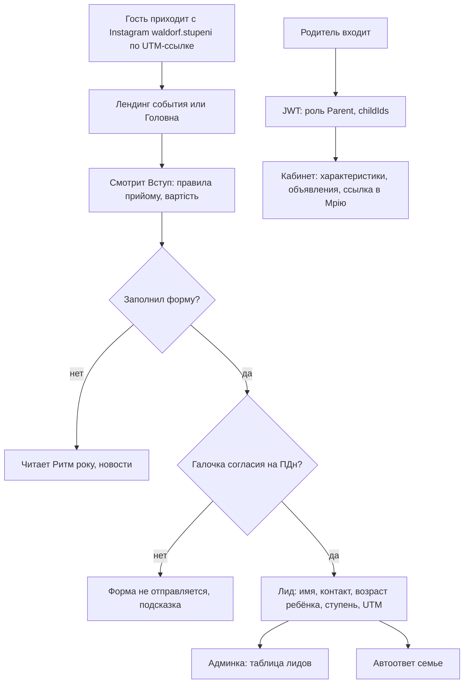

### <a id="m1-api"></a>1.11 Ключевые сущности и API (пример / предлагаемая структура)

```http
GET  /api/public/pages/{slug}            # about-us/history, school-structure/kindergarten …
GET  /api/public/news?page=1
GET  /api/public/events?from=2026-10-01&to=2026-12-31
GET  /api/public/openness                # дерево раздела «Інформаційна відкритість»
POST /api/public/leads                   # замена Contact Form 7 (wpcf7-f254-o1)
POST /api/public/subscriptions
GET  /api/parent/children/{childId}/summary
```

```json
// POST /api/public/leads — пример (поля как в текущей форме + согласие и UTM)
{
  "name": "Олена",
  "phone": "+380501234567",
  "email": "olena@example.com",
  "message": "Хочемо на екскурсію, донька 6 років",
  "stage": "elementary-school",
  "consentPersonalData": true,
  "utm": { "source": "instagram", "medium": "social", "campaign": "yarmarok-2026", "content": "post-7f3a" }
}
```

### <a id="m1-risks"></a>1.12 Риски

- **Уже опубликованные фото детей** (hero, «Наша школа», новости) — без реестра согласий. Перед снятием `noindex` — ревизия всех 75 медиа.
- **Снятие `noindex` откроет и старое.** Сначала обновить/архивировать новости 2023 года, потом индексировать.
- **Поломка ссылок.** Сохранить slug из WordPress, 301 с дублей.
- **Лишние данные в форме** — не спрашиваем ФИО и дату рождения ребёнка; хватает возраста.
- **Позиция «против дистанционки» vs ст. 30.** Формулировку о формах обучения согласовать с юристом ([чек-лист](#compliance)).

[↑ к оглавлению](#toc) · [→ далее: 2. Админка](#mod-admin)

---

## <a id="mod-admin"></a>2. Админка

### <a id="m2-purpose"></a>2.1 Назначение

Рабочее место команды школы, которое заменяет wp-admin: контент сайта, **реестр официальных документов ст. 30**, пользователи и роли, ученики и классы, [согласия](#g-consent), [лиды](#g-lead), очередь одобрений. Это **источник правды** для остальных модулей. [Журнал](#mod-journal) — её подмодуль (`/admin/journal/*`).

### <a id="m2-roles"></a>2.2 Пользователи и роли

Директор, администратор (секретарь), бухгалтерия (документы о плате и помощи), [классный (основний) учитель](#g-class-teacher), учитель-предметник и куратор старших классов, вихователь садочка, SMM, приёмная комиссия. Полная таблица — в [Ролях и правах](#roles).

### <a id="m2-in"></a>2.3 Входные данные

- Мигрированный контент WordPress ([catalog.json](file:///D:/Site/waldorf-stupeni-school-redesign/catalog.json), [wp-json](file:///D:/Site/waldorf-stupeni-school-redesign/wp-json/index.html)).
- Тексты, фото, события от сотрудников; черновики от [оркестратора](#mod-orch) и [агента соцсетей](#mod-social).
- PDF официальных документов (статут, ліцензії, правила прийому, документы о булинге…) — по списку §6 документа для администрации.
- Лиды с [сайта](#mod-site) и из соцсетей; согласия родителей.

### <a id="m2-out"></a>2.4 Выходные данные

- Контент и документы → [сайт](#mod-site).
- Пользователи, роли, связи «родитель — ребёнок — класс» → [журнал](#mod-journal), Auth.
- Реестр согласий → [агент соцсетей](#mod-social), галерея сайта.
- Решения approve/reject → [оркестратор](#m5-hitl), [агент соцсетей](#m4-steps).

### <a id="m2-links"></a>2.5 Связи с другими модулями

- [Сайт](#mod-site): публикует контент и раздел «Інформаційна відкритість», принимает лиды.
- [Журнал](#mod-journal): общий каркас (меню, роли, пользователи).
- [Соцсети](#mod-social): очередь черновиков, CRM лидов, реестр согласий.
- [Оркестратор](#mod-orch): очередь [HITL](#g-hitl), журнал аудита, проверка свежести документов.

### <a id="m2-docs"></a>2.6 Реестр официальных документов (ст. 30)

Каждый пункт [чек-листа](#compliance) — запись в реестре: `requirement_code`, файл PDF, дата утверждения, дата публикации, ответственный, «применимо к частной школе: да / нет / уточнить». Правило из ст. 30: публиковать **не позднее 10 рабочих дней** после утверждения или изменения — админка считает срок и напоминает.

### <a id="m2-steps"></a>2.7 Шаги автоматизации

1. **Триггер: миграция WordPress** → импорт 17 страниц, 5 новостей, 75 медиа; для каждого медиа — задача «отметить детей на фото / подтвердить, что детей нет».
2. **Триггер: импорт CSV учеников** → профили учеников и родителей → приглашения родителям.
3. **Триггер: согласие подписано / отозвано** → реестр согласий; при `consent.revoked` — снять фото с сайта, задача SMM удалить из соцсетей.
4. **Триггер: документ ст. 30 утверждён** → таймер 10 рабочих дней → напоминания ответственному на 5-й и 8-й день → эскалация директору.
5. **Триггер: раз в квартал** → отчёт «что в реестре устарело или пусто» (для директора и [оркестратора](#m5-steps)).
6. **Триггер: новый лид** → ответственный по ступени (садочок / школа) → SLA 48 ч.
7. **Триггер: черновик от агента или оркестратора** → карточка в «Очереди одобрения».
8. **Триггер: изменение ролей, согласий, документов** → [журнал аудита](#g-audit).

### <a id="m2-diagram"></a>2.8 Схема

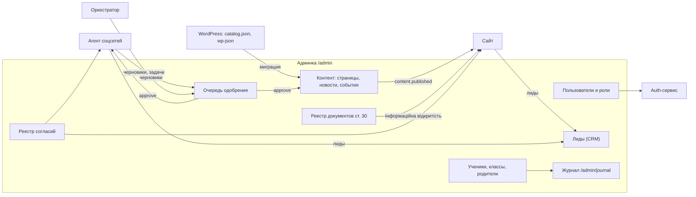

### <a id="m2-api"></a>2.9 Ключевые сущности и API (пример / предлагаемая структура)

```http
POST   /api/admin/import/wordpress          # источник: catalog.json + wp-json
POST   /api/admin/news                      # черновик
POST   /api/admin/news/{id}/publish
GET    /api/admin/official-docs?status=missing
POST   /api/admin/official-docs             # { requirementCode, file, approvedAt, ownerId }
POST   /api/admin/consents
POST   /api/admin/consents/{id}/revoke
GET    /api/admin/leads?status=new
PATCH  /api/admin/leads/{id}
GET    /api/admin/approvals?status=pending
POST   /api/admin/approvals/{id}/decision
```

```sql
-- пример / предлагаемая структура
CREATE TABLE official_docs (
  id               uuid PRIMARY KEY,
  requirement_code text NOT NULL,      -- 'statut', 'license', 'admission_rules', 'tuition_fee', 'bullying_plan' …
  applies_private  text NOT NULL,      -- 'yes' | 'no' | 'clarify'
  file_id          uuid REFERENCES files(id),
  approved_at      date,
  published_at     date,
  owner_id         uuid REFERENCES staff(id),
  due_at           date GENERATED ALWAYS AS (approved_at + 14) STORED  -- ≈10 рабочих дней, точный расчёт — в коде
);

CREATE TABLE consents (
  id uuid PRIMARY KEY, student_id uuid NOT NULL, guardian_id uuid NOT NULL,
  kind text NOT NULL,                  -- photo_site | photo_social | name_public | personal_data
  text_version text NOT NULL, granted_at timestamptz NOT NULL,
  expires_at timestamptz, revoked_at timestamptz
);

CREATE TABLE leads (
  id uuid PRIMARY KEY, created_at timestamptz NOT NULL DEFAULT now(),
  source text NOT NULL,                -- site_form | meta_lead_ads | telegram_bot
  stage text,                          -- kindergarten | elementary-school | …
  utm_source text, utm_medium text, utm_campaign text, utm_content text,
  name text NOT NULL, phone text, email text, child_age int,
  status text NOT NULL DEFAULT 'new', owner_id uuid, consent_pd boolean NOT NULL
);
```

### <a id="m2-risks"></a>2.10 Риски

- **Избыточные права** — учитель видит только свои классы; экспорт списков — с записью в аудит.
- **Документы опубликованы и забыты** — реестр с датами и ответственными (§6 п. 10 документа для администрации).
- **Утечка через импорт** — CSV и выгрузки удаляются через 24 ч.
- **Миграция перенесёт старые фото** без согласий — по умолчанию они скрыты.

[↑ к оглавлению](#toc) · [→ далее: 3. Электронный журнал](#mod-journal)

---
## <a id="mod-journal"></a>3. Электронный журнал + «Мрія»

### <a id="m3-purpose"></a>3.1 Назначение

Учёт успеваемости, посещаемости и расписания с вальдорфской спецификой. Оценивание бывает двух видов, журнал поддерживает оба:

- **Описательная [характеристика](#g-characteristic)** — текст о развитии ребёнка за [эпоху](#g-epoch), семестр или год (в младших классах — основная форма, созвучно вербальному оцениванию НУШ в 1–4 классах). Годовая характеристика может включать персональное изречение для ребёнка.
- **Баллы** — 12-балльная шкала там, где она нужна (средняя и старшая школа, семестровая атестація — она упомянута в [Правилах школи](file:///D:/Site/waldorf-stupeni-school-redesign/about-us/rules/index.html)).

Главное отличие от версии 0.1: в Украине уже есть государственная экосистема **[«Мрія»](#g-mriia)**, поэтому журнал строится **вокруг неё, а не вместо неё** — см. [3.9](#m3-mriia).

### <a id="m3-roles"></a>3.2 Пользователи и роли

| Роль | Права |
|---|---|
| [Основний (классный) учитель](#g-class-teacher) | свой класс: эпохи, характеристики; посещаемость — там, где мастер-система ([3.9](#m3-mriia)) |
| Учитель-предметник, куратор 9–11 | свои предметы и группы: оценки, комментарии |
| Вихователь садочка | посещаемость и «день вихованця» (в «Мрії» для ЗДО — пилот) |
| Администрация | сводки, расписание, закрытие периода, решение по интеграции с «Мрією» |
| Родитель | чтение по своему ребёнку: характеристики — у нас, официальные оценки и пропуски — в «Мрії» (или у нас при варианте Б) |

### <a id="m3-in"></a>3.3 Входные данные

- Ученики, классы, связи с родителями — из [админки](#mod-admin).
- Расписание: сетка уроков + блоки эпох (основний урок 1 год 45 хв, несколько недель на тему — как описано на странице [Середня школа](file:///D:/Site/waldorf-stupeni-school-redesign/school-structure/secondary-school/index.html)).
- Тексты характеристик, баллы, отметки посещаемости — **один раз**, в мастер-системе.

### <a id="m3-out"></a>3.4 Выходные данные

- Кабинет родителя на [сайте](#mod-site): опубликованные характеристики, эпохи, объявления + deep-link в «Мрію».
- Сводки для администрации и [оркестратора](#mod-orch) (агрегаты).
- Печатная годовая характеристика (PDF).
- Официальные данные — в «Мрії» (вариант А — вводятся там; вариант Б — синхронизируются от нас).

### <a id="m3-links"></a>3.5 Связи с другими модулями

- ← [Админка](#mod-admin): профили, роли, классы.
- → [Сайт](#mod-site): кабинет родителя (только чтение).
- ↔ «Мрія» (внешняя): см. [3.9](#m3-mriia).
- → [Оркестратор](#mod-orch): чтение сводок; запись — только с подтверждением ([HITL](#m5-hitl)).
- ✕ [Соцсети](#mod-social): **связи нет намеренно**.

### <a id="m3-steps"></a>3.6 Шаги автоматизации

1. **Триггер: начало урока** → учитель отмечает только исключения (опоздал / отсутствует) — **в мастер-системе посещаемости** (вариант А — «Мрія», вариант Б — наш журнал).
2. **Триггер: `attendance.marked`** (вариант Б) → через 30 минут (окно для исправления) уведомление родителю; в варианте А уведомление отправляет сама «Мрія» — **мы не дублируем**.
3. **Триггер: 3 дня отсутствия подряд** → сигнал основному учителю и администрации (вариант А — по импортированному снимку, если экспорт доступен — *уточнить*).
4. **Триггер: конец эпохи** → напоминание написать характеристику; автосохранение черновика.
5. **Триггер: «Опубликовать характеристику»** → уведомление родителю (без текста в самом уведомлении).
6. **Триггер: изменение расписания** → уведомление и обновление на сайте.
7. **Триггер: закрытие семестра** → записи блокируются; исправления — с причиной и аудитом.
8. **Триггер: ночная синхронизация** (вариант Б) → отправка изменений в «Мрію», сверка, отчёт о расхождениях.

### <a id="m3-diagram"></a>3.7 Схема данных

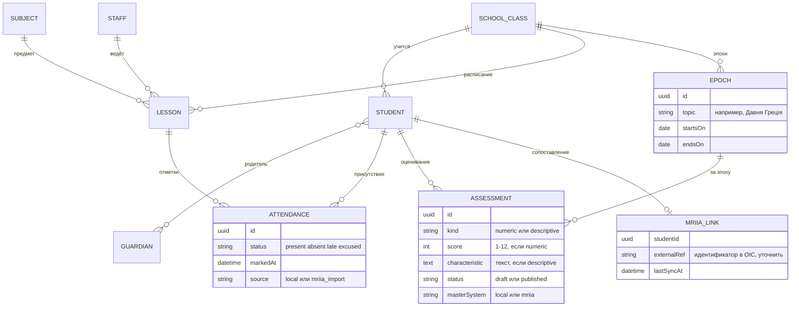

### <a id="m3-api"></a>3.8 Ключевые сущности и API (пример / предлагаемая структура)

```http
GET  /api/journal/classes/{classId}/timetable?week=2026-W41
POST /api/journal/lessons/{lessonId}/attendance      # только если мастер = local (вариант Б)
POST /api/journal/assessments                        # descriptive всегда у нас; numeric — по варианту
POST /api/journal/assessments/{id}/publish
GET  /api/journal/reports/attendance?classId=...&period=2026-S1
GET  /api/journal/mriia/status                       # режим (A/B), последняя синхронизация, расхождения
POST /api/journal/mriia/import                       # загрузка экспорта, если он доступен (уточнить)
```

```json
// POST /api/journal/assessments — характеристика за эпоху (пример)
{
  "studentId": "8c1e…",
  "epochId": "ancient-greece-5-2026",
  "kind": "descriptive",
  "characteristic": "Марко з захопленням готувався до давньогрецької Олімпіади…",
  "status": "draft",
  "masterSystem": "local"
}
```

### <a id="m3-mriia"></a>3.9 Интеграция с «Мрією»: без двойного ввода

**Что известно (проверено 06.10.2026):**

- [«Мрія»](https://mriia.gov.ua/app) — государственная освітня екосистема (Мінцифри + МОН): электронные журналы и дневники, расписание, оценки, пропуски, push-уведомления родителям в приложении, чаты на базе Signal; бесплатна для школ; для ЗДО — пилот. Уведомлений через Telegram/Viber у неё нет. Родителю для входа нужны РНОКПП и Дія / BankID — у семей без украинского РНОКПП доступа не будет.
- [Постанова КМУ № 177 від 16.02.2024](https://zakon.rada.gov.ua/laws/show/177-2024-%D0%BF) (ред. 25.04.2026), п. 9 поручает **Мінцифри и МОН** обеспечить с 2024/25 учебного года использование «Мрії» или подключённых к ней [ОІС](#g-ois). Это задание министерствам, а не прямая обязанность школы.
- **Электронный журнал не обязателен**: по [разъяснению МОН (НУШ, 08.09.2025)](https://nus.org.ua/2025/09/08/elektronnyj-zhurnal-u-shkoli-shho-potribno-znaty/) школа может вести журнал в электронной форме по приказу МОН № 707, порядок делопроизводства определяет руководитель, систему выбирает педагогическая рада; ОІС, отвечающие требованиям, подключаются к [АІКОМ](#g-aikom). «Мрія» — бесплатная государственная альтернатива; подключение добровольное (по сообщениям КМУ/МОН — *ссылки перепроверить*).
- Предпосылка подключения к «Мрії» — актуальные данные школы, классов и учеников в АІКОМ 2.0; у лицея, по открытым данным АІКОМ, есть карточка (№ 23389) — *актуальность классов и учеников уточнить*.
- П. 20: школы работают с «Мрією» через свои освітні системи или через систему «Мрія»; подключение ОІС — **бесплатно, по договору о присоединении** с технічним адміністратором Порталу Дія. На странице «Мрії» есть форма «Підключити іншу ОІС»; уже подключены, например, Human школа и Eddy.
- П. 38: обмен идёт через [«Трембіту»](#g-trembita), а объём и структура данных задаются договорами об информационном взаимодействии; при другом канале нужна [КСЗІ](#g-kszi) с подтверждённым соответствием.
- **Публичного открытого API с документацией мы не нашли.** Интеграция возможна только через официальное подключение ОІС — и это серьёзный юридико-технический проект.

**Кто мастер для каких данных:**

| Данные | Вариант А (рекомендуется для старта) | Вариант Б (цель, если школа решит) |
|---|---|---|
| Официальные оценки (баллы) | «Мрія» — учитель ставит там | наш журнал → синхронизация в «Мрію» |
| Посещаемость, пропуски | «Мрія» (она же уведомляет родителей) | наш журнал → «Мрія» |
| Расписание | «Мрія» + у нас копия для сайта (ввод один раз — *уточнить, есть ли экспорт*) | наш журнал → «Мрія» |
| Характеристики, эпохи, изречения | **наш журнал** (в «Мрії» есть вербальная шкала для младших классов, но развёрнутые тексты-характеристики за эпоху — *уточнить*) | наш журнал |
| Связь родитель–ребёнок | админка (для сайта); «Мрія» — своя через Дію/РНОКПП | админка + сопоставление `MRIIA_LINK` |

**Варианты интеграции:**

1. **А. «Мрія» — мастер официальных данных, мы — вальдорфский слой.** Ничего не дублируем: кабинет родителя показывает характеристики и ссылку «Оцінки та пропуски — у Мрії». Для сводок — загрузка экспорта, *если веб-портал «Мрії» его даёт (уточнить)*, иначе сводки по посещаемости оркестратор не строит.
2. **Б. Наш журнал как ОІС, подключённая к «Мрії».** Учитель вводит всё один раз у нас, данные уходят в «Мрію». Путь: заявка «Підключити іншу ОІС» → договор о присоединении → техтребования, «Трембіта»/КСЗІ → тестовая синхронизация. Сроки и требования — *уточнить у команды «Мрії»* (отдел подключения указан на [mriia.gov.ua/app](https://mriia.gov.ua/app)).
3. **В. Готовая подключённая ОІС + наш слой.** Например, Human школа (подключена к «Мрії» 09.08.2024): заявлены вербальное оценивание и заметки классного руководителя, она платная (тарифы — *уточнить*). Тогда мастер — она, а у нас остаются сайт, кабинет и эпохи. *Уточнить импорт/экспорт.*
4. **Без электронного журнала.** Поскольку он не обязателен, можно вести официальный журнал на бумаге, а у нас — только вальдорфский слой и уведомления. Самый дешёвый вариант, но сводок по пропускам у оркестратора не будет.

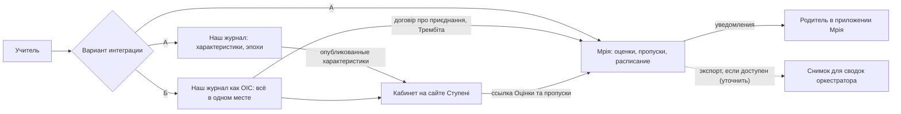

### <a id="m3-risks"></a>3.10 Риски

- **Двойной ввод** — главный риск отказа учителей. Правило: каждое поле имеет одну мастер-систему, второе место показывает его только для чтения.
- **Выбор системы — решение педсовета** (электронный журнал не обязателен); решение по варианту А/Б/В принимает администрация до старта фазы 2.
- **Самые чувствительные данные** — характеристики: доступ строго по ролям, шифрование, в LLM — только обезличенно ([оркестратор](#m5-risks)).
- **Родитель видит не своего ребёнка** — серверная проверка `childId ∈ token.childIds` + тест.
- **Ограничения доступа** (решения суда, опека) — флаг в связи «опекун — ребёнок».
- **Вариант Б = требования к защите информации** (КСЗІ, договор) — бюджет и сроки могут превысить пользу; начинать с А.

[↑ к оглавлению](#toc) · [→ далее: 4. Агент рекламы в соцсетях](#mod-social)

---

## <a id="mod-social"></a>4. Агент рекламы в соцсетях

### <a id="m4-purpose"></a>4.1 Назначение

У школы уже есть каналы — [Facebook](https://www.facebook.com/waldorf.stupeni), [Instagram](https://www.instagram.com/waldorf.stupeni/), [YouTube](https://www.youtube.com/@WaldorfStupeni), [TikTok](https://www.tiktok.com/@stupeni_school) (ссылки взяты из шапки [index.html](file:///D:/Site/waldorf-stupeni-school-redesign/index.html)). Агент помогает вести их регулярно: готовит посты по «Ритм року» и событиям, ставит в расписание, **публикует только после одобрения человеком** и возвращает [лидов](#g-lead) на [сайт](#mod-site) и в [CRM админки](#mod-admin) через [UTM](#g-utm).

### <a id="m4-roles"></a>4.2 Пользователи и роли

- **SMM / коммуникации** — правит и одобряет посты без детей на фото.
- **Директор** — одобряет посты с детьми и всё о позиции школы.
- **Приёмная комиссия** — лиды.
- [Оркестратор](#mod-orch) — поручает кампании, но не одобряет публикации.

### <a id="m4-in"></a>4.3 Входные данные

- События и новости из [админки](#mod-admin); календарь праздников из «Ритм року» (Свято врожаю, св. Михаїла, ліхтариків, різдвяна спіраль, св. Миколая, Масляна, Олімпійські ігри, День школи…).
- Медиатека с метками «кто на фото» и реестр согласий (`photo_social`).
- Бренд-гайд: тёплый тон, «безгаджетний простір» ([Медіа в освітньому процесі](file:///D:/Site/waldorf-stupeni-school-redesign/about-us/media/index.html)), украинский язык.

### <a id="m4-out"></a>4.4 Выходные данные

- Черновики постов в очереди одобрения.
- Посты со ссылками вида `https://www.waldorf-stupeni.school/<slug>/?utm_source=instagram&utm_medium=social&utm_campaign=yarmarok-2026`.
- Лиды из Meta Lead Ads / Telegram-бота; еженедельные метрики.

### <a id="m4-links"></a>4.5 Связи с другими модулями

- ← [Админка](#mod-admin): события, медиа, согласия; → черновики, лиды, метрики.
- → [Сайт](#mod-site): трафик с UTM.
- ← [Оркестратор](#mod-orch): кампании; → статусы.
- ✕ [Журнал](#mod-journal): связи нет.

### <a id="m4-steps"></a>4.6 Шаги автоматизации

1. **Триггер: публичное событие в админке или праздник из «Ритм року» через 14 дней** → план мини-кампании: анонс, напоминание за 3 дня, итоги.
2. **Генерация** текста по бренд-гайду; факты (дата, место, цена) — только из карточки события.
3. **Фильтр согласий**: медиа с ребёнком без действующего `photo_social` или без разметки — исключается.
4. **UTM** на каждую ссылку (`content` = id поста).
5. **Черновик → очередь одобрения** с чек-листом «согласия ок, без фамилий детей, без геометок».
6. **Одобрено** → расписание → публикация через API сети с [ключом идемпотентности](#g-idempotency). TikTok и YouTube — пока вручную (агент готовит текст и обложку).
7. **Ошибка API** → 3 повтора → задача человеку.
8. **Webhook лид-формы / сообщение боту** → лид в CRM → автоответ.
9. **Раз в неделю** → отчёт: посты, клики, лиды, экскурсии.

### <a id="m4-diagram"></a>4.7 Схема

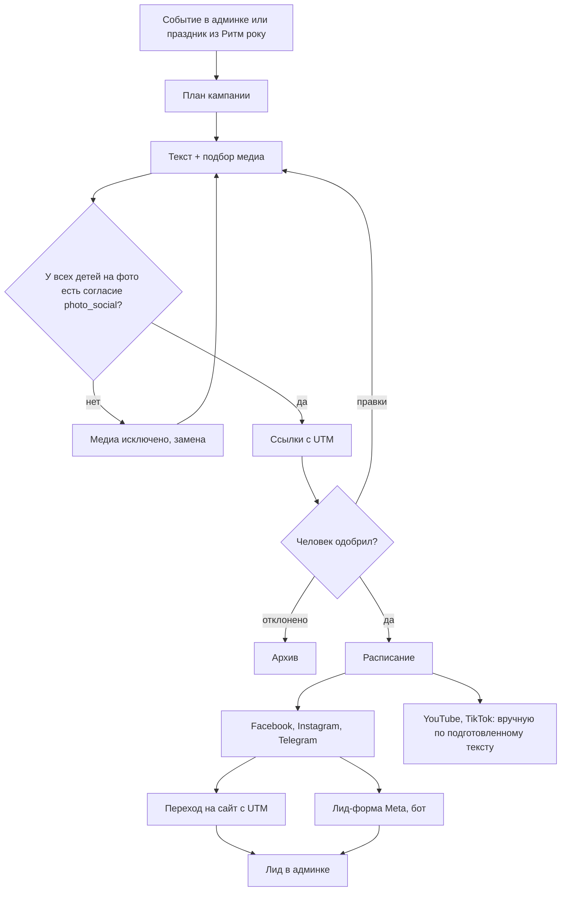

### <a id="m4-api"></a>4.8 Ключевые сущности и API (пример / предлагаемая структура)

```http
POST /api/social/campaigns                  # { eventId, channels, goal }
POST /api/social/posts/{id}/submit
POST /api/social/posts/{id}/schedule        # только после approve, иначе 409
POST /api/social/webhooks/meta-leads
POST /api/social/webhooks/telegram
GET  /api/social/metrics?campaign=yarmarok-2026
```

```json
{
  "id": "post-7f3a",
  "campaignId": "yarmarok-2026",
  "channel": "instagram",
  "text": "Різдвяний ярмарок у «Ступенях»! Свічки з бджолиного воску, пироги та ляльковий театр 🕯️",
  "mediaIds": ["m-221", "m-224"],
  "consentCheck": { "passed": true, "checkedAt": "2026-10-06T11:20:00Z" },
  "link": "https://www.waldorf-stupeni.school/news/?utm_source=instagram&utm_medium=social&utm_campaign=yarmarok-2026&utm_content=post-7f3a",
  "status": "pending_approval"
}
```

### <a id="m4-risks"></a>4.9 Риски

- **Фото ребёнка без согласия** — автоматический фильтр + чек-лист; `photo_site` ≠ `photo_social`.
- **Отзыв согласия** → удалить пост/фото в течение 72 ч, пометка в аудите.
- **Галлюцинации** — факты только из карточки события.
- **Ограничения платформ** — публикация через Instagram API только для профессионального аккаунта; токены истекают; для TikTok/YouTube — ручной шаг.
- **Тон** — школа против гаджетозависимости: никаких призывов «держите телефон ребёнка рядом»; посты для взрослых.

[↑ к оглавлению](#toc) · [→ далее: 5. Оркестратор](#mod-orch)

---

## <a id="mod-orch"></a>5. Оркестратор

### <a id="m5-purpose"></a>5.1 Назначение

AI-агент (по типу Grok Bot), который принимает задачу обычным языком — «анонсуй Різдвяний ярмарок», «що ще не опубліковано за ст. 30?», «зведення до педради за I семестр» — сам решает, какие модули задействовать, вызывает их через [инструменты](#g-tool-registry), просит подтверждение на рискованных шагах и возвращает итог. Единый процесс над всеми модулями, а не пятый источник данных. С «Мрією» он **не работает напрямую** — только через [журнал](#m3-mriia).

### <a id="m5-roles"></a>5.2 Пользователи и роли

- Директор и администрация — полный набор инструментов в рамках своих [прав](#roles).
- SMM — контент и соцсети.
- Учителя — чтение своих классов + черновики объявлений.
- Оркестратор **действует от имени пользователя**: токен = права пользователя, расширение невозможно.

### <a id="m5-in"></a>5.3 Входные данные

- Задача пользователя (чат в админке, позже Telegram-бот для сотрудников).
- [Реестр инструментов](#g-tool-registry) с уровнем риска.
- Контекст: роль, ближайшие события «Ритм року», бренд-гайд, состояние [реестра документов](#m2-docs), режим интеграции с «Мрією».

### <a id="m5-out"></a>5.4 Выходные данные

- Ссылки на черновики и публикации, сводки, списки пробелов по ст. 30.
- Запросы на подтверждение в очереди [админки](#m2-steps).
- Записи в [журнале аудита](#g-audit).

### <a id="m5-links"></a>5.5 Связи с другими модулями

- → [Сайт](#mod-site) (через API админки): новости, страницы событий.
- → [Админка](#mod-admin): черновики, лиды, follow-up, проверка реестра документов.
- → [Журнал](#mod-journal): агрегаты; данные «Мрії» — только из импортированного снимка или при варианте Б.
- → [Соцсети](#mod-social): кампании.

### <a id="m5-steps"></a>5.6 Шаги автоматизации

1. **Задача от пользователя** → токен пользователя + список доступных ему инструментов.
2. **План** → короткое резюме пользователю («створю новину, 3 пости, лендинг — ок?»).
3. **Классификация риска**: `read` / `draft` / `publish` / `sensitive`.
4. **`read` и `draft`** — сразу.
5. **`publish` и `sensitive`** → карточка [HITL](#g-hitl); таймаут 48 ч → отмена.
6. **Если данных нет** (например, пропуски в варианте А без экспорта) — честно говорит «эти данные в Мрії, откройте отчёт там», а не придумывает.
7. **Проверка ответа**, повтор с тем же [ключом идемпотентности](#g-idempotency).
8. **Итог** со ссылками + аудит.
9. **По расписанию**: понедельник 08:00 (Europe/Kiev) — сводка директору: новые лиды, документы ст. 30 с истекающим сроком, «новостей не было N дней», ближайшие праздники.

### <a id="m5-diagram"></a>5.7 Схема

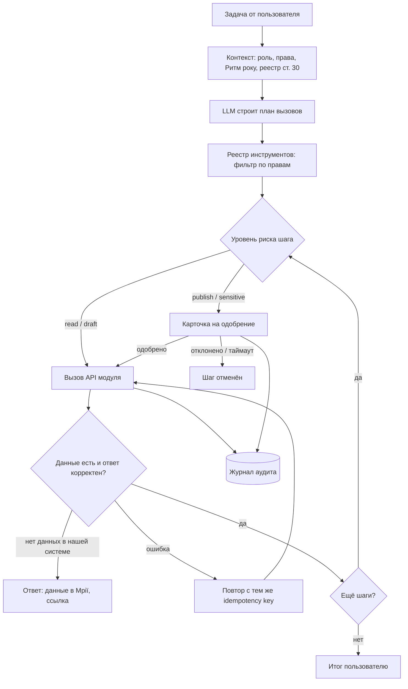

### <a id="m5-hitl"></a>5.8 Права, human-in-the-loop и аудит

| Уровень риска | Примеры инструментов | Что происходит |
|---|---|---|
| `read` | `journal.attendance_report`, `journal.mriia_status`, `leads.list`, `official_docs.gaps` | сразу, в рамках прав пользователя |
| `draft` | `news.create_draft`, `social.create_campaign`, `official_docs.request_from_owner` | сразу, результат — черновик |
| `publish` | `news.publish`, `social.schedule_post`, `official_docs.publish`, `mail.send_bulk` | только после одобрения Editor/Director |
| `sensitive` | `journal.write_assessment`, `journal.mriia_import`, `users.change_role`, `consents.*`, экспорт ПДн | одобрение + повторное подтверждение; в LLM — только обезличенные данные |

Правило: оркестратор не одобряет собственный запрос. Аудит append-only.

### <a id="m5-api"></a>5.9 Реестр инструментов и API (пример / предлагаемая структура)

```json
{
  "name": "official_docs.gaps",
  "module": "admin",
  "description": "Список требований ст. 30, по которым нет документа или истёк срок публикации (10 рабочих дней)",
  "risk": "read",
  "requiredRoles": ["Director", "Admin"],
  "inputSchema": { "type": "object", "properties": { "appliesPrivate": { "enum": ["yes", "clarify", "all"] } } },
  "endpoint": "GET /api/admin/official-docs?status=missing"
}
```

```http
POST /api/orchestrator/tasks                 # { "prompt": "Анонсуй Різдвяний ярмарок 13 грудня" }
GET  /api/orchestrator/tasks/{id}
POST /api/orchestrator/tasks/{id}/cancel
GET  /api/orchestrator/tools
GET  /api/admin/audit?actor=orchestrator&taskId=...
```

Инструменты удобно отдавать как [MCP](#g-mcp)-сервер поверх API модулей.

### <a id="m5-risks"></a>5.10 Риски

- **Детские данные в LLM** — обезличивание, характеристики в контекст не попадают; провайдер без обучения на данных.
- **Prompt injection** из лидов и комментариев — это данные, не инструкции; `publish`/`sensitive` всё равно через человека.
- **Выдуманные данные** — если источник в «Мрії» недоступен, агент говорит об этом прямо.
- **Эскалация прав** — сервисный «суперключ» запрещён.

[↑ к оглавлению](#toc) · [→ далее: Чек-лист ст. 30](#compliance)

---
## <a id="compliance"></a>Чек-лист обязательной информации (ст. 30 + НУШ)

Источники: статья НУШ [«Що має бути на сайті школи?»](https://nus.org.ua/2025/04/26/shho-maye-buty-na-sajti-shkoly/) (26.04.2025, на основе [ст. 30](#g-art30) Закона «Про освіту» и Закона «Про повну загальну середню освіту») и [документ для администрации «Ступенів»](file:///D:/Site/waldorf-stupeni-school-redesign/Informaciyna-vidkrytist-sajt-Stupeni.md) (05.10.2026). «Есть сейчас» — по копии сайта от 21.09.2026. Колонка «Частной школе» — наша оценка; окончательно — *уточнить с юристом / засновником*. Все документы ведутся в [реестре админки](#m2-docs) и показываются в [разделе «Інформаційна відкритість»](#m1-openness).

**Легенда:** ✅ есть · 🟡 частично · ❌ нет · ⚪ не применимо к частной школе (по оценке) · ⭐ особенно важно для частной школы

| # | Требование | Частной школе | Есть сейчас? | Где в новом сайте |
|---|---|---|---|---|
| 1 | Статут закладу освіти | обязательно | ❌ | [Документи закладу](#m1-openness) |
| 2 | Ліцензії на освітню діяльність | обязательно | ❌ | [Документи закладу](#m1-openness) |
| 3 | Сертифікати про акредитацію освітніх програм | если есть | ❌ | [Документи закладу](#m1-openness) |
| 4 | Структура та органи управління, засновник | обязательно | ❌ | [Управління та кадри](#m1-openness) |
| 5 | Кадровий склад згідно з ліцензійними умовами | обязательно | 🟡 27 карточек «Наші вчителі» на [главной](file:///D:/Site/waldorf-stupeni-school-redesign/index.html) | [Управління та кадри](#m1-openness) + карусель на [Головній](#m1-add) |
| 6 | Освітні програми та освітні компоненти | обязательно | ❌ ([Методичні матеріали](file:///D:/Site/waldorf-stupeni-school-redesign/about-us/methodical-materials/index.html) почти пусты) | [Освітній процес](#m1-openness) |
| 7 | Територія обслуговування | ⚪ закрепляется засновником для государственных/коммунальных | ❌ | — (указать «не застосовується», *уточнить*) |
| 8 | Ліцензований обсяг і фактична кількість учнів | обязательно | ❌ | [Освітній процес](#m1-openness) |
| 9 | Мова (мови) освітнього процесу | обязательно | ❌ (сайт украиноязычный, явно не указано) | [Освітній процес](#m1-openness) |
| 10 | Вакантні посади, порядок конкурсу | вакансии — да; конкурс — если проводится | ❌ | [Управління та кадри](#m1-openness) |
| 11 | Матеріально-технічне забезпечення | обязательно | ❌ (есть фото «Наша школа») | [Освітній процес](#m1-openness) |
| 12 | Результати моніторингу якості освіти | обязательно | ❌ | [Звітність](#m1-openness), данные — из [журнала](#m3-out) |
| 13 | Річний звіт про діяльність | обязательно | ❌ | [Звітність](#m1-openness) |
| 14 | Правила прийому (школа + садочок) | ⭐ обязательно, свои правила | ❌ | [Вступ](#m1-add) + [Інформаційна відкритість](#m1-openness) |
| 15 | Умови доступності для осіб з ООП | обязательно | 🟡 есть [Корекційно-лікувальний блок](file:///D:/Site/waldorf-stupeni-school-redesign/school-structure/correctional-treatment-block/index.html), нет документа об условиях | [Безпека та інклюзія](#m1-openness) |
| 16 | Розмір плати за навчання | ⭐ ключевой для частной | ❌ | [Вступ](#m1-add) + [Інформаційна відкритість](#m1-openness) |
| 17 | Додаткові освітні та інші послуги, вартість, порядок оплати | ⭐ ключевой для частной (гуртки, [Семінар](file:///D:/Site/waldorf-stupeni-school-redesign/school-structure/seminar/index.html), харчування) | ❌ | [Вступ](#m1-add) |
| 18 | Правила поведінки здобувача освіти | обязательно | 🟡 [Правила школи](file:///D:/Site/waldorf-stupeni-school-redesign/about-us/rules/index.html) — сверить полноту | [Правила школи](#cur-content) + ссылка из [Безпека та інклюзія](#m1-openness) |
| 19 | План заходів протидії булінгу | обязательно | ❌ | [Безпека та інклюзія](#m1-openness) |
| 20 | Порядок подання та розгляду заяв про булінг (конфіденційно) | обязательно | ❌ | [Безпека та інклюзія](#m1-openness) + защищённая форма в [админку](#m2-api) |
| 21 | Порядок реагування на доведені випадки булінгу | обязательно | ❌ | [Безпека та інклюзія](#m1-openness) |
| 22 | Форми здобуття освіти (очна, дистанційна, екстернат, сімейна, педпатронаж) | обязательно; описать, какие реально предлагаются | ❌ + на главной «виступаємо проти дистанційної освіти» | [Освітній процес](#m1-openness); формулировку *уточнить* ([риски](#m1-risks)) |
| 23 | Спроможність, кількість учнів у класах, вільні місця | для частной — как добрая практика (наличие мест) | ❌ | [Вступ](#m1-add) |
| 24 | Списки зарахованих, жеребкування, конкурсна комісія | ⚪ для государственных/коммунальных (Порядок зарахування) | ❌ | — |
| 25 | Конкурс на посаду керівника (ст. 39 ЗУ «Про ПЗСО») | ⚪ для государственных/коммунальных | ❌ | — |
| 26 | Кошторис і фінансовий звіт (≤ 10 робочих днів) | ⚪ если получает публичные средства — *уточнить* | ❌ | [Звітність](#m1-openness) (при необходимости) |
| 27 | Благодійна допомога: перелік і вартість | обязательность — при публичных средствах; как добрая практика — ⭐ (есть сбор «Коло друзів») | ❌ | [Допомогти нам + звіт](#m1-add) |
| 28 | Загальні збори (конференція) колективу | обязательно | ❌ | [Управління та кадри](#m1-openness) |
| 29 | Інституційний аудит: результати, висновок | если проводился | ❌ | [Звітність](#m1-openness) |
| 30 | Громадська акредитація (≤ 10 днів після сертифіката) | если проводилась | ❌ | [Звітність](#m1-openness) |
| 31 | Щоденне меню за віковими групами | обязательно (школа и садочок) | ❌ | [Харчування](#m1-openness) |
| 32 | Організація, що надає послуги харчування | обязательно | ❌ | [Харчування](#m1-openness) |
| 33 | Контакти, адреса | обязательно | ✅ [Контакти](file:///D:/Site/waldorf-stupeni-school-redesign/contacts/index.html) | [Контакти](#cur-content) |

**Первая очередь** (по §5 документа для администрации): №1–2, 14, 16–17, 19–21, 22, 6. **Вторая:** 31–32, 5, 15, 13, 12, 26–27. Свежесть отслеживает [оркестратор](#m5-steps) еженедельной сводкой.

[↑ к оглавлению](#toc) · [→ далее: Сквозные сценарии](#scenarios)

---

## <a id="scenarios"></a>Сквозные сценарии

Четыре истории, в которых модули работают вместе.

### <a id="sc-fair"></a>Сценарий А. Директор просит оркестратор анонсировать ярмарку

В 2023 году ярмарок анонсировали новостью [«Різдвяний ярмарок 16 грудня»](file:///D:/Site/waldorf-stupeni-school-redesign/rizdvyanyj-yarmarok-16-grudnya/index.html) — и на этом новости закончились. Теперь директор пишет: «Анонсуй Різдвяний ярмарок 13 грудня, пост в Instagram і Facebook». Итог: новость на [сайте](#mod-site), посты в [соцсетях](#mod-social), лиды в [админке](#mod-admin).

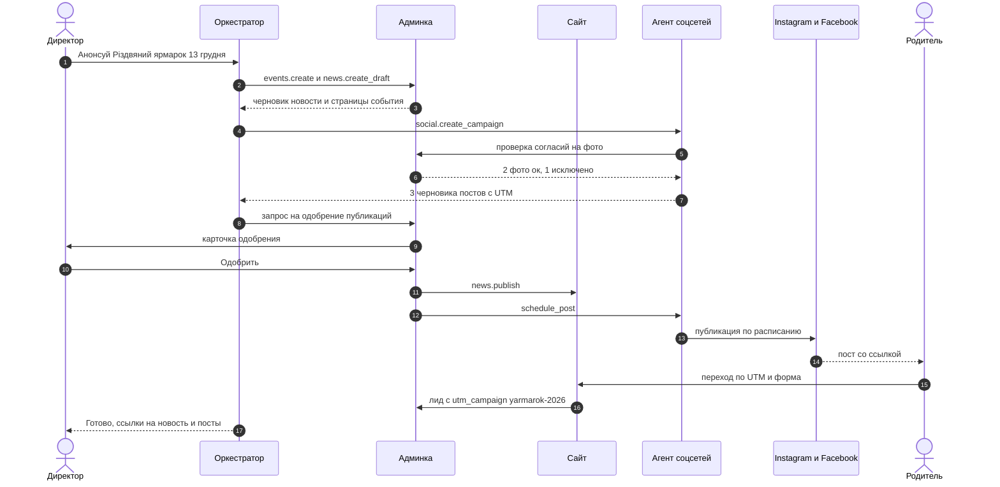

### <a id="sc-attendance"></a>Сценарий Б. Учитель отмечает посещаемость → уведомление родителю

Одна точка ввода — в зависимости от [варианта интеграции с «Мрією»](#m3-mriia).

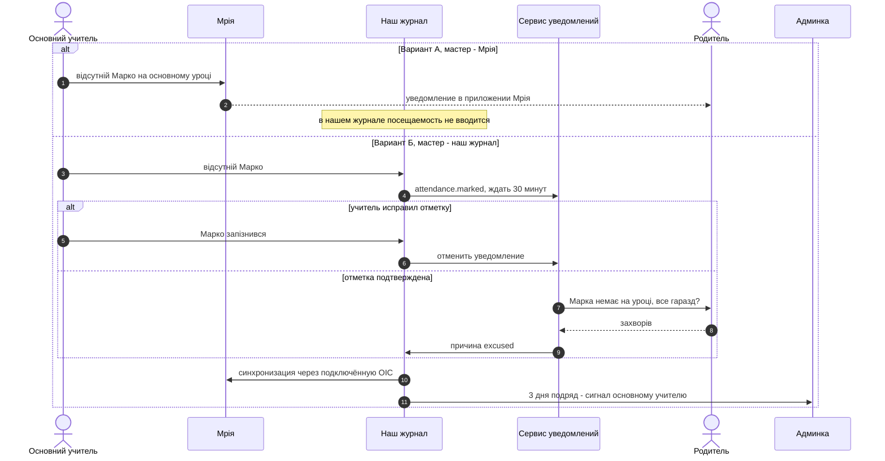

### <a id="sc-lead"></a>Сценарий В. Родитель оставил заявку из Instagram → лид в админке → follow-up

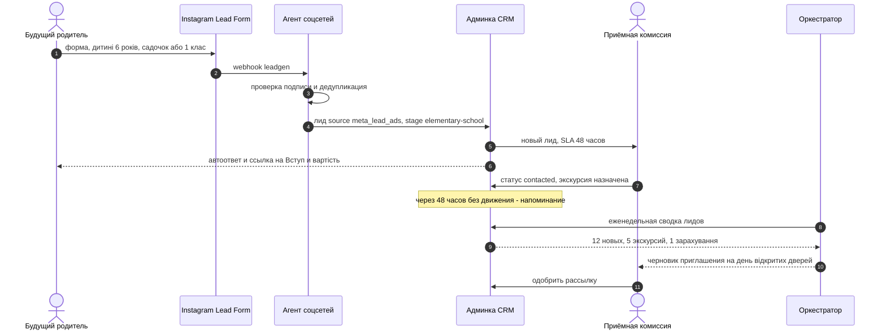

### <a id="sc-mriia"></a>Сценарий Г. Сводка к педсовету с учётом «Мрії»

Директор: «Підготуй зведення до педради за I семестр: характеристики, пропуски, що з документами ст. 30». Оркестратор собирает из [журнала](#mod-journal) и [админки](#m2-docs) и честно отмечает, чего нет.

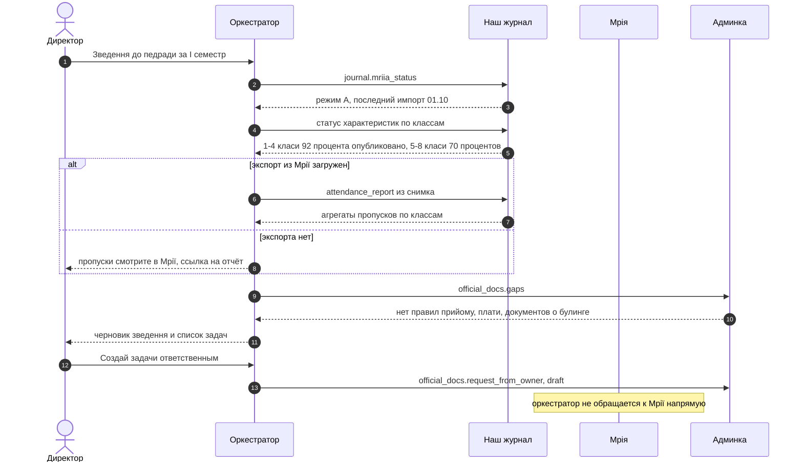

[↑ к оглавлению](#toc) · [→ далее: Роли и права доступа](#roles)

---

## <a id="roles"></a>Роли и права доступа

Модель — [RBAC](#g-rbac) + ограничение по объектам (свой класс, свой ребёнок). ✅ — полный доступ, ✏️ — черновик/правка без публикации, 👁 — чтение, 🔒 — только в своей области, — — нет доступа.

| Возможность | Директор | Администратор | Основний учитель | Предметник / куратор | Вихователь | SMM | Приёмная комиссия | Бухгалтерия | Родитель | Оркестратор |
|---|---|---|---|---|---|---|---|---|---|---|
| Новости и страницы | ✅ | ✅ | ✏️ | ✏️ | ✏️ | ✏️ | — | — | 👁 | ✏️ (публикация через [HITL](#m5-hitl)) |
| Документы ст. 30 | ✅ | ✅ | — | — | — | — | 👁 | ✏️ плата, допомога | 👁 | 👁 пробелы, ✏️ запросы |
| Пользователи и роли | ✅ | ✅ | — | — | — | — | — | — | — | — |
| Ученики, классы, родители | ✅ | ✅ | 🔒👁 | 🔒👁 | 🔒👁 | — | — | — | 🔒👁 свой ребёнок | 👁 агрегаты |
| Согласия | ✅ | ✅ | 👁 | — | 👁 | 👁 статус | — | — | ✅ свои | — |
| Посещаемость (мастер — см. [3.9](#m3-mriia)) | 👁 | 👁 | 🔒✅ | 🔒✅ | 🔒✅ | — | — | — | 🔒👁 | 👁 сводки |
| Оценки и [характеристики](#g-characteristic) | 👁 | — | 🔒✅ | 🔒✅ | — | — | — | — | 🔒👁 опубликованные | — (только с HITL) |
| Посты в соцсетях | ✅ одобрение | 👁 | — | — | — | ✏️ + ✅ без детей | — | — | — | ✏️ |
| Лиды (CRM) | ✅ | ✅ | — | — | — | 👁 агрегаты | ✅ | — | — | ✏️ заметки |
| Журнал аудита | 👁 | 👁 | — | — | — | — | — | — | — | — (только пишет) |

[↑ к оглавлению](#toc) · [→ далее: Приватность и закон](#privacy)

---

## <a id="privacy"></a>Приватность и закон: общие правила

Это не юридическое заключение — перед запуском нужна проверка юристом.

- **Закон Украины «Про захист персональних даних»** (№ 2297-VI): согласие или законное основание, минимизация, право на доступ и удаление. За несовершеннолетних согласие дают родители (законные представители). Надзор — Уповноважений Верховної Ради з прав людини. Следить за новой редакцией закона, гармонизированной с GDPR.
- **GDPR-подобная дисциплина**: реестр обработок, [DPIA](#g-dpia) для журнала и оркестратора, сроки хранения, процедура при утечке.
- **Образовательное законодательство**: [ст. 30](#g-art30) Закона «Про освіту» — см. [чек-лист](#compliance); [Постанова КМУ № 177](https://zakon.rada.gov.ua/laws/show/177-2024-%D0%BF) о «Мрії» и приказ МОН № 707 об электронной документации — см. [3.9](#m3-mriia). Telegram и Viber — зарубежные сервисы: родителей нужно предупредить о передаче данных за границу.
- **Согласия на фото — гранулярные**: `photo_site`, `photo_social`, `name_public`; версия текста, срок (учебный год), отзыв в кабинете. Ревизия уже опубликованных фото — до снятия `noindex`.
- **Минимизация**: публично — имя без фамилии и только с `name_public`; никаких геометок и расписаний конкретных детей. Учителя на сайте — с их согласия (сейчас 27 карточек с ФИО и фото).
- **Хранение**: понятная юрисдикция серверов, шифрование, резервные копии, журнал доступа к ПДн.
- **LLM**: только обезличенные данные; провайдер без обучения на данных клиента.

[↑ к оглавлению](#toc) · [→ далее: Технологический стек](#stack)

---

## <a id="stack"></a>Технологический стек

| Слой | Рекомендация | Почему |
|---|---|---|
| Backend API | .NET 8, слои Api / Domain / Infrastructure | типовая слоистая архитектура: логика отделена от базы и веб-слоя |
| Авторизация | отдельный Auth-сервис, [JWT](#g-jwt); API — resource server | роли в токене, единый вход |
| БД | PostgreSQL | связи «клас — учень — батьки», JSONB |
| Фоновые задачи | Hangfire / Quartz.NET + [outbox](#g-outbox) | отложенные публикации, сроки ст. 30, повторы |
| Публичный сайт | React 19 + Vite с предрендером (или Astro для SSG); дизайн-токены из [style.css](file:///D:/Site/waldorf-stupeni-school-redesign/wp-content/themes/waldorf/style.css) | SEO после снятия `noindex`, сохранение узнаваемого стиля |
| Карусели | заменить jQuery + Flickity ([flickity.pkgd.js](file:///D:/Site/waldorf-stupeni-school-redesign/wp-content/themes/waldorf/js/flickity.pkgd.js)) на лёгкий компонент или оставить Flickity без jQuery | меньше JS на мобильных |
| Формы | `POST /api/public/leads` вместо Contact Form 7 | работает без PHP, есть согласие и UTM |
| Миграция | скрипт импорта из [catalog.json](file:///D:/Site/waldorf-stupeni-school-redesign/catalog.json) и [wp-json/wp/v2/pages/](file:///D:/Site/waldorf-stupeni-school-redesign/wp-json/wp/v2/pages/) | сохранить slug и тексты |
| Файлы | S3-совместимое хранилище, приватные бакеты | фото детей не по публичным URL |
| Уведомления | Email + Telegram Bot API (бесплатно); Viber — позже (новые боты с 2024 года — по заявке и платно, *уточнить тариф*) | «Мрія» уведомляет только push-ами в своём приложении |
| Журнал | наш модуль + «Мрія» по [варианту А/Б](#m3-mriia) | без двойного ввода |
| Оркестратор | LLM с tool calling + [MCP](#g-mcp)-сервер | единый [реестр инструментов](#g-tool-registry) |
| Тесты | xUnit + интеграционные тесты прав | «родитель видит только своего» |

### <a id="stack-lowcode"></a>Альтернатива: оставить WordPress как CMS

Можно не мигрировать контент, а использовать текущий WordPress headless (через тот же REST API, что в [wp-json](file:///D:/Site/waldorf-stupeni-school-redesign/wp-json/index.html)) и n8n для соцсетей и лидов. Быстрее для [сайта](#mod-site), но [журнал](#mod-journal), согласия и роли всё равно лучше держать в своём бэкенде, а WordPress придётся поддерживать и защищать (`xmlrpc.php` и т. п.).

[↑ к оглавлению](#toc) · [→ далее: План внедрения](#rollout)

---

## <a id="rollout"></a>План внедрения

| Фаза | Что входит | Критерий готовности |
|---|---|---|
| **0. Подготовка** | документы первой очереди ст. 30 ([чек-лист](#compliance)), тексты согласий, ревизия 75 медиа, DPIA, решение по «Мрії» (А/Б), заявка в «Мрію» при варианте Б | администрация передала PDF; решение по журналу принято |
| **1. Редизайн (MVP)** | миграция WP → [админка](#mod-admin); [сайт](#mod-site) с «Інформаційна відкритість», «Вступ», рабочей формой; снятие `noindex`, 301, sitemap | первая свежая новость и первый лид; раздел ст. 30 заполнен по первой очереди |
| **2. Журнал** | [характеристики и эпохи](#mod-journal), кабинет родителя со ссылкой на «Мрію»; вариант А | семестр в двух классах-пилотах без двойного ввода |
| **3. Соцсети** | [агент](#mod-social) с одобрением, UTM-отчёты, календарь «Ритм року» | кампания к празднику с измеренными лидами |
| **4. Оркестратор** | `read`/`draft`, затем `publish` через HITL; еженедельная сводка директору | 4 недели без инцидентов |
| **Дальше** | вариант Б (ОІС ↔ «Мрія») — если договор и требования реалистичны; онлайн-пожертвования для «Допомогти нам»; Telegram-бот для сотрудников | по решению школы |

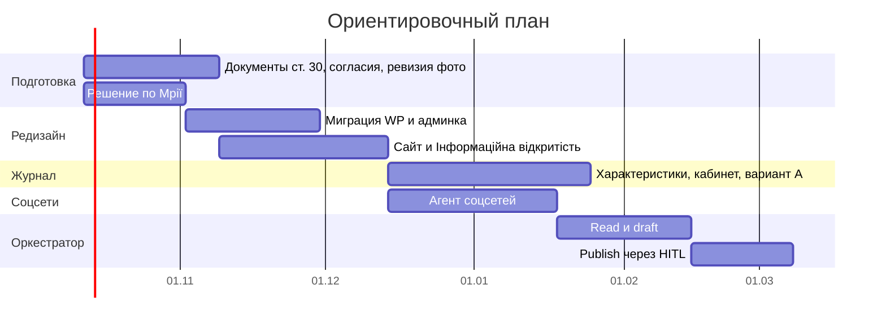

[↑ к оглавлению](#toc) · [→ далее: Глоссарий](#glossary)

---

## <a id="glossary"></a>Глоссарий

- <a id="g-aikom"></a>**АІКОМ** — Автоматизований інформаційний комплекс освітнього менеджменту, центральная база данных МОН; через неё подключаются ОІС и «Мрія».
- <a id="g-audit"></a>**Журнал аудита** — неизменяемый лог: кто, когда, что сделал, через какой модуль, кто одобрил.
- <a id="g-outbox"></a>**Outbox / очередь событий** — событие (`lead.created`, `attendance.marked`) пишется в БД в одной транзакции с данными и надёжно доставляется подписчикам.
- <a id="g-characteristic"></a>**Характеристика (описательное оценивание)** — текстовая оценка развития ребёнка вместо или вместе с баллами.
- <a id="g-class-teacher"></a>**Основний (классный) учитель** — в вальдорфской школе ведёт класс много лет и проводит основний урок; в старших классах его сменяет куратор.
- <a id="g-dpia"></a>**DPIA** — оценка влияния на защиту данных.
- <a id="g-epoch"></a>**Эпоха** — блок основного уроку: несколько недель ежедневных занятий по одной теме.
- <a id="g-hitl"></a>**Human-in-the-loop (HITL)** — рискованное действие выполняется только после явного одобрения человеком.
- <a id="g-idempotency"></a>**Ключ идемпотентности** — повторный вызов с тем же ключом не создаёт дубль.
- <a id="g-kszi"></a>**КСЗІ** — комплексна система захисту інформації; требуется для ряда систем обмена данными с государственными ресурсами.
- <a id="g-lead"></a>**Лид** — заявка потенциальной семьи: контакт + интерес + источник.
- <a id="g-mcp"></a>**MCP (Model Context Protocol)** — протокол, через который AI-агент получает и вызывает инструменты.
- <a id="g-mriia"></a>**«Мрія»** — государственная освітня екосистема (застосунок + вебпортал, Мінцифри/МОН): журналы, дневники, расписание, уведомления; регулируется Постановою КМУ № 177.
- <a id="g-ois"></a>**ОІС** — електронна освітня інформаційна система (сторонний электронный журнал), которую можно подключить к «Мрії».
- <a id="g-pdn"></a>**ПДн** — персональные данные.
- <a id="g-rbac"></a>**RBAC** — доступ на основе ролей, дополненный ограничениями по объектам.
- <a id="g-consent"></a>**Согласие** — разрешение родителя на конкретный вид обработки с версией текста, сроком и отзывом.
- <a id="g-art30"></a>**Ст. 30 Закона «Про освіту»** — «Прозорість та інформаційна відкритість закладу освіти»: перечень информации, обязательной к публикации на сайте.
- <a id="g-tool-registry"></a>**Реестр инструментов (tool registry)** — каталог действий оркестратора: имя, схема, уровень риска, роли, эндпоинт.
- <a id="g-trembita"></a>**«Трембіта»** — государственная система электронного взаимодействия реестров, через которую идёт обмен данными с «Мрією».
- <a id="g-utm"></a>**UTM-метки** — параметры ссылки (`utm_source`, `utm_medium`, `utm_campaign`, `utm_content`), показывающие источник визита.
- <a id="g-jwt"></a>**JWT** — подписанный токен доступа с ролями; выдаётся Auth-сервисом.

[↑ к оглавлению](#toc) · [→ в начало: Коротко о проекте](#intro)
