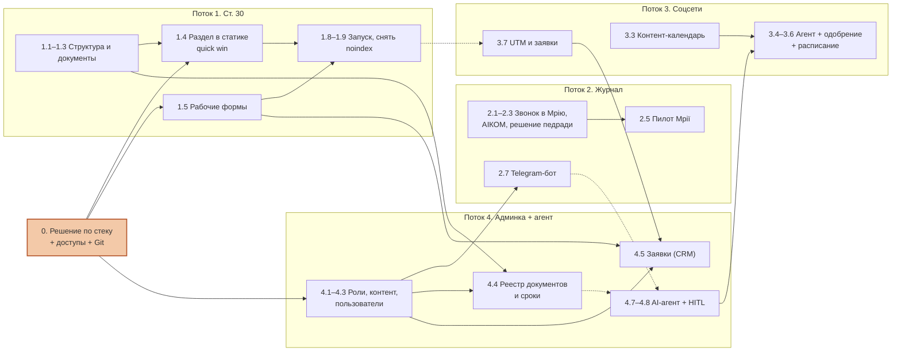
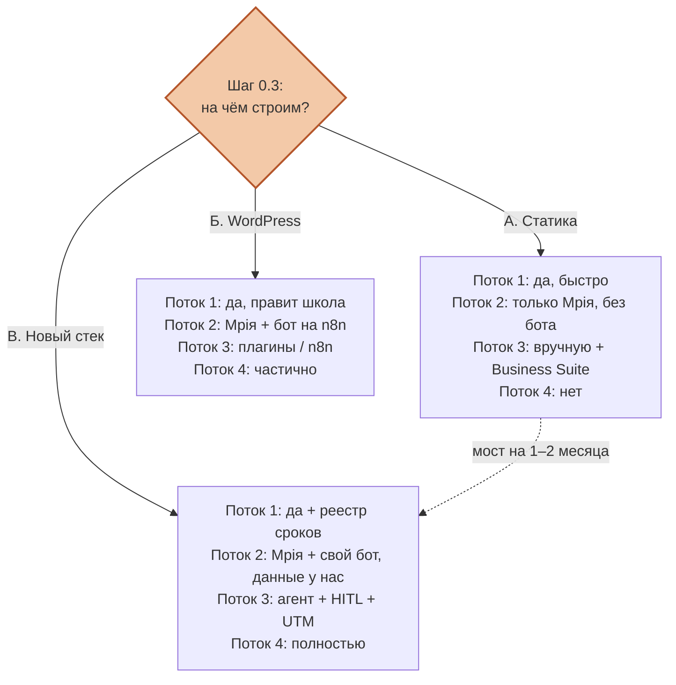
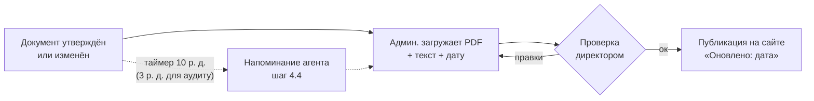
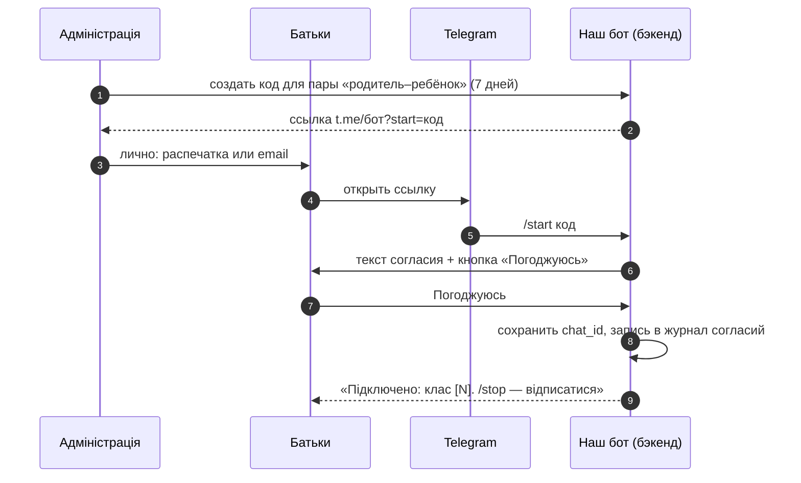
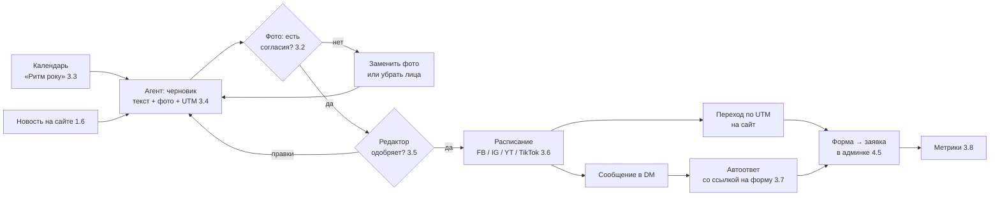
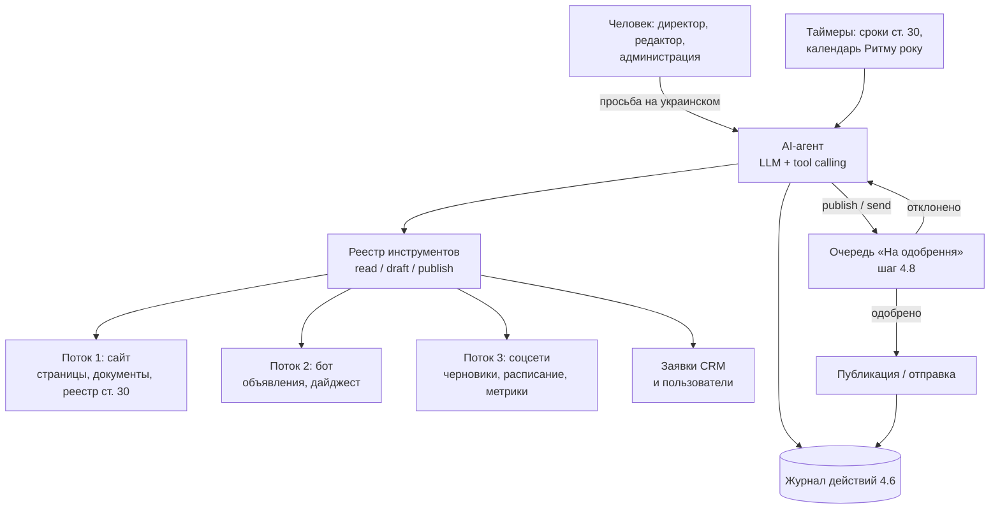
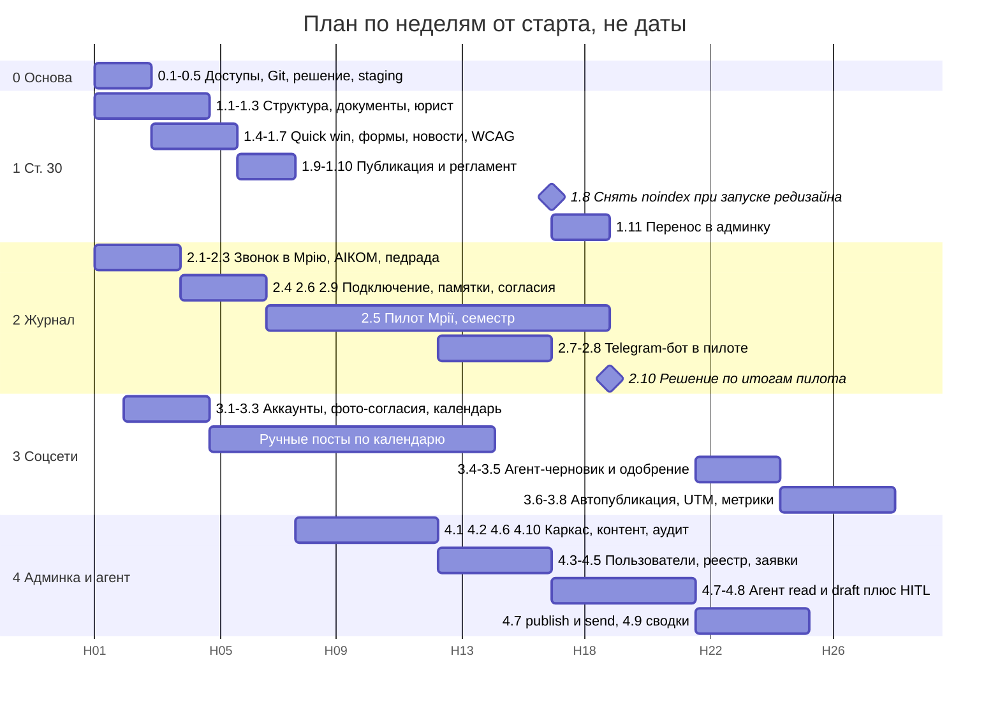

# План действий по проекту «Ступені»: сайт, журнал, соцсети, админка с AI-агентом

> **Для кого:** Сергей (разработчик и организатор проекта) и руководство вальдорфского лицея и детского сада «Ступені» ([waldorf-stupeni.school](https://www.waldorf-stupeni.school/), тел. +380 48 799-70-24).
> **Что это:** пошаговый план: что делаем, в каком порядке, кто отвечает, что нужно от школы. Это пара к документу [«Схема автоматизации»](Вальдорфская-школа-схема-автоматизации.html): там описано, **как устроена** система, а здесь **как её построить**.
> **Версия:** 1.0, 6 октября 2026. Все оценки трудозатрат — **ориентировочные** (⚠️ оценка). Факты о школе, которых у нас нет (плата, число учеников, номера лицензий), помечены **[уточнить у школы]**.
> **Условные знаки:** ✅ проверено по источнику · ⚠️ не проверено или наша оценка · ❓ открытый вопрос.

## Оглавление

1. [Коротко](#summary): 4 потока, порядок, общий объём
2. [Текущее состояние](#current): что есть, ссылки на файлы проекта
3. [Карта зависимостей между потоками](#deps)
4. [Ключевое решение: на чём строим](#decision) (статика / WordPress / новый стек) и [шаги 0.x](#s0-steps)
5. [Поток 1. Обязательные разделы по ст. 30](#s1)
6. [Поток 2. Электронный журнал и учёт](#s2)
7. [Поток 3. Соцсети](#s3)
8. [Поток 4. Админка + AI-агент](#s4)
9. [Общий график](#gantt)
10. [Чек-лист для школы](#checklist)
11. [Открытые вопросы](#questions)
12. [Источники](#sources)
13. [Глоссарий](#glossary)

У каждого потока одинаковые подразделы: **Цель → Результат → Шаги → Порядок/этапы → Что нужно от школы → Технические требования → Оценка сложности → Риски.** Шаги пронумерованы (1.1, 1.2 …, 2.1 …), на каждый можно сослаться: например, [шаг 1.5](#st-1-5) — починить формы.

---

## Коротко

**Задача.** Сейчас у школы красивый, но «застывший» сайт: последняя новость — декабрь 2023 года, формы обратной связи в копии сайта не работают, сайт скрыт от поисковиков (`noindex`, см. [глоссарий](#g-noindex)), а обязательного по закону блока «Інформаційна відкритість» по сути нет. Мы хотим не просто перерисовать сайт, а сделать **рабочую систему** из четырёх частей — «потоков»:

| № | Поток | Что получит школа | Срочность | Объём ⚠️ оценка |
|---|---|---|---|---|
| 0 | [Основа: решение по стеку, доступы, репозиторий](#decision) | один источник правды, понятно «на чём строим» | сразу | 3–6 чел.-дней |
| 1 | [Обязательные разделы по ст. 30](#s1) | раздел «Інформаційна відкритість», рабочие формы, свежие новости, сайт виден в Google | **высокая** — это требование закона | 10–18 чел.-дней |
| 2 | [Электронный журнал и учёт](#s2) | «Мрія» как официальный журнал (пилот), свой Telegram-бот для родителей | средняя | 12–25 чел.-дней (гибрид) |
| 3 | [Соцсети](#s3) | агент готовит посты по «Ритму року», человек одобряет, публикация по расписанию, заявки попадают в список | средняя | 15–25 чел.-дней |
| 4 | [Админка + AI-агент](#s4) | одна панель управления: контент, пользователи, роли, документы, заявки; AI-помощник, который всё связывает | постепенно | 25–45 чел.-дней |

**Порядок.** 0 → 1 (быстрая победа, [quick win](#g-quickwin)) → параллельно 2 (звонок в «Мрію» и пилот) и 3 (ручной контент-план) → 4 (админка) → перенос 1–3 под управление админки и агента. Подробнее — [карта зависимостей](#deps) и [общий график](#gantt).

**Итого ⚠️ (оценка):** примерно **65–120 человеко-дней** ([чел.-день](#g-personday) — один рабочий день одного человека) разработки, то есть **4–7 месяцев** при одном разработчике на неполную загрузку. Самое долгое — не код, а **сбор документов и решений от школы** (см. [чек-лист для школы](#checklist)).

**Главная рекомендация в одну строку:** сначала быстро закрываем закон (поток 1) на статической копии, параллельно звоним в «Мрію»; а «большую» систему (поток 4) строим на новом стеке, как описано в [схеме: технологический стек](Вальдорфская-школа-схема-автоматизации.html#stack). Почему так — в разделе [Ключевое решение](#decision).

[↑ к оглавлению](#toc) · [→ далее: Текущее состояние](#current)

---

## Текущее состояние

### Что есть в папке проекта

Папка на ноутбуке Сергея [`D:\Site\waldorf-stupeni-school-redesign`](file:///D:/Site/waldorf-stupeni-school-redesign/) — это **статическое зеркало** (клон, копия в виде готовых HTML-файлов) живого сайта на WordPress ([глоссарий: WordPress](#g-wp), [статика](#g-static)). Сделано 21 сентября 2026 года для редизайна.

| Файл / папка | Что это | Важно для шагов |
|---|---|---|
| [README.md](file:///D:/Site/waldorf-stupeni-school-redesign/README.md) | описание клона: формы не работают, `noindex`, как запустить | [1.5](#st-1-5), [1.8](#st-1-8) |
| [start.bat](file:///D:/Site/waldorf-stupeni-school-redesign/start.bat) | локальный просмотр: запускает `npx serve -l 5180 .` → `http://127.0.0.1:5180/` | [0.2](#st-0-2) |
| [catalog.json](file:///D:/Site/waldorf-stupeni-school-redesign/catalog.json) | список 17 страниц, 5 записей (новостей) и 75 медиафайлов из WP REST API ([API](#g-api)) | [4.2](#st-4-2) — миграция |
| [mirror-report.json](file:///D:/Site/waldorf-stupeni-school-redesign/mirror-report.json) | отчёт зеркалирования: 365 файлов, 30 ошибок — почти все 404 по «мусорным» адресам `…/r/` (артефакт зеркала, по разбору проекта), плюс `xmlrpc.php` и `oembed` | [1.8](#st-1-8) |
| [rules/](file:///D:/Site/waldorf-stupeni-school-redesign/rules/index.html) (и `history/`, `media/`, `waldorf-pedagogy/`, `methodical-materials/` в корне) | страницы-перенаправления, добавлены 24.09.2026: чинят короткие ссылки | [1.8](#st-1-8) |
| [about-us/waldorf-pedagogy/](file:///D:/Site/waldorf-stupeni-school-redesign/about-us/waldorf-pedagogy/index.html), [about-us/methodical-materials/](file:///D:/Site/waldorf-stupeni-school-redesign/about-us/methodical-materials/index.html) | **заглушки** «Вибачте, ця сторінка в розробці» | [1.6](#st-1-6) |
| [index.html](file:///D:/Site/waldorf-stupeni-school-redesign/index.html) | главная страница | [1.4](#st-1-4), [1.6](#st-1-6) |
| [wp-content/themes/waldorf/style.css](file:///D:/Site/waldorf-stupeni-school-redesign/wp-content/themes/waldorf/style.css) | стили темы `waldorf` — источник цветов и шрифтов | [1.4](#st-1-4), [4.2](#st-4-2) |
| [js/flickity.pkgd.js](file:///D:/Site/waldorf-stupeni-school-redesign/wp-content/themes/waldorf/js/flickity.pkgd.js), [jquery-3.7.0.min.js](file:///D:/Site/waldorf-stupeni-school-redesign/wp-content/themes/waldorf/js/jquery-3.7.0.min.js) | карусели (галерея, «Ритм року», учителя) | [1.7](#st-1-7) |
| [contact-form-7/…/index.js](file:///D:/Site/waldorf-stupeni-school-redesign/wp-content/plugins/contact-form-7/includes/js/index.js) | скрипт форм Contact Form 7 — в статике не отправляет письма | [1.5](#st-1-5) |
| [wp-json/](file:///D:/Site/waldorf-stupeni-school-redesign/wp-json/index.html), [wp-json/wp/v2/pages/129](file:///D:/Site/waldorf-stupeni-school-redesign/wp-json/wp/v2/pages/129/index.html) | сохранённые ответы WP REST API (тексты страниц) | [4.2](#st-4-2) |
| [contacts/](file:///D:/Site/waldorf-stupeni-school-redesign/contacts/index.html), [help-us/](file:///D:/Site/waldorf-stupeni-school-redesign/help-us/index.html), [news/](file:///D:/Site/waldorf-stupeni-school-redesign/news/index.html) | «Контакти» (форма), «Допомогти нам», «Новини» | [1.5](#st-1-5), [1.6](#st-1-6), [3.7](#st-3-7) |
| [about-us/rules/](file:///D:/Site/waldorf-stupeni-school-redesign/about-us/rules/index.html) | «Правила школи» — частично закрывает «правила поведінки»; в тексте **старое название «НВК «Ступені»»** вместо «ліцей» | [1.2](#st-1-2), [1.6](#st-1-6) |
| [school-structure/correctional-treatment-block/](file:///D:/Site/waldorf-stupeni-school-redesign/school-structure/correctional-treatment-block/index.html) | «Корекційно-лікувальний блок» — основа для пункта «умови доступності (ООП)» | [1.2](#st-1-2) |
| [school-structure/kindergarten/](file:///D:/Site/waldorf-stupeni-school-redesign/school-structure/kindergarten/index.html) | «Дитячий садочок» — нужны отдельные правила прийому | [1.2](#st-1-2) |
| [Informaciyna-vidkrytist-sajt-Stupeni.md](file:///D:/Site/waldorf-stupeni-school-redesign/Informaciyna-vidkrytist-sajt-Stupeni.md) (= [dlya-administracii-informaciyna-vidkrytist.md](file:///D:/Site/waldorf-stupeni-school-redesign/dlya-administracii-informaciyna-vidkrytist.md)) | служебная записка для администрации про ст. 30: перечень, структура раздела, приоритеты | [1.1](#st-1-1), [1.2](#st-1-2) |
| [xmlrpc.php](file:///D:/Site/waldorf-stupeni-school-redesign/xmlrpc.php) | след WordPress; на новом сайте не нужен (риск атак) | [0.3](#st-0-3) |

**Что уже изменено в копии** (по разбору проекта `screens-and-project-review.md`): 05.10.2026 переделаны шапка и мобильное меню, баннеры с «точками фокуса» на лицах, блоки «Структура школи» (полный текст, фото в «рваной» рамке, шахматный порядок), навигация по якорям; [style.css](file:///D:/Site/waldorf-stupeni-school-redesign/wp-content/themes/waldorf/style.css) вырос примерно на 535 строк. **Тексты, фото и новости не менялись.** Рядом в проекте на ноутбуке лежит папка `_debug-header` (86 рабочих скриншотов «до/после») — это не часть сайта, при публикации её нужно исключить ([1.9](#st-1-9)). Нетронутая копия зеркала — `D:\Site\waldorf-stupeni-school`. Исходный сайт — WordPress 7.1 с темой «Waldorf» (студия Полещука, 2023), плагины Contact Form 7 + reCAPTCHA v3, следы ACF.

**Чего нет:** папка **не** является [Git](#g-git)-репозиторием (нет истории изменений); нет заготовок (stubs, «болванок») для админки, журнала и [бэкенда](#g-backend). Всё это создаём с нуля — см. [поток 4](#s4).

### Что видно на сайте

По скриншотам (папки `source/screens`: desktop-1…6, mobile-1…6, и 26 снимков из `D:\Фото сайта` — из них 24 уникальных; это снимки **локальной правленой копии** на `localhost:5180`, а не живого сайта; подробный разбор — в схеме, раздел [«Как сейчас: скриншоты»](Вальдорфская-школа-схема-автоматизации.html#cur-shots)):

- **Главная:** первый экран (hero) с цитатой Штайнера и кнопками «Залишайтеся на зв'язку» и «Підтримайте нас»; блоки «Чому вальдорфська школа?» (там сказано, что школа **против дистанционного обучения** — важно для пункта «форми здобуття освіти», см. [1.2](#st-1-2)), «Структура школи», «Ритм року» (13 праздников — основа [контент-календаря](#st-3-3)), «Наші вчителі та вихователі» (27 карточек, 24 человека — есть повторы), новости, галерея, форма «Напишіть нам». Фраза «ми виступаємо проти дистанційної освіти» есть и на странице «Про нас».
- **Контакты:** Одеса, вул. Ільфа та Петрова, 31-А; телефоны 799-70-24 (офіс), 799-70-25 (бухгалтерія), 715-66-22 (вахта) — по странице [«Контакти»](file:///D:/Site/waldorf-stupeni-school-redesign/contacts/index.html).
- **«Допомогти нам»:** призыв «20 євро протягом 20 місяців», но **нет реквизитов, кнопки оплаты или формы** — кнопка «Підтримайте нас» ведёт туда, где помочь нельзя → [1.6](#st-1-6).
- **Заглушки:** «Вальдорфська педагогіка» и «Методичні матеріали» — «сторінка в розробці» → [1.6](#st-1-6).
- **Новости:** 5 записей, все — декабрь 2023 года (последняя от 16.12.2023, по [catalog.json](file:///D:/Site/waldorf-stupeni-school-redesign/catalog.json)). Для родителей это выглядит как «школа не живёт» → [шаг 1.6](#st-1-6).
- **Соцсети в подвале:** Facebook `waldorf.stupeni`, Instagram `waldorf.stupeni`, TikTok `@stupeni_school` (ссылки есть в [index.html](file:///D:/Site/waldorf-stupeni-school-redesign/index.html)). YouTube на сайте не найден → [3.1](#st-3-1).
- **Формальный блок «Інформаційна відкритість»** практически отсутствует (подтверждает и [записка для администрации](file:///D:/Site/waldorf-stupeni-school-redesign/Informaciyna-vidkrytist-sajt-Stupeni.md), раздел 2). По разбору скриншотов: из 17 пунктов ст. 30 полностью закрыт 1 (правила поведінки, и тот нужно обновить), частично — 4 (кадровий склад, правила прийому — только для садочка, умови доступності, обсяг — только наполняемость групп садочка), остальных нет; слова «булінг» на сайте нет вообще.
- **Технически:** тема `waldorf`, формы Contact Form 7 с reCAPTCHA, на живом сайте `noindex, nofollow`. Подробнее — [схема: «Технически»](Вальдорфская-школа-схема-автоматизации.html#cur-tech) и [«Главные пробелы»](Вальдорфская-школа-схема-автоматизации.html#cur-gaps).

### Главные пробелы → какой шаг их закрывает

| Пробел | Шаг |
|---|---|
| нет раздела «Інформаційна відкритість» | [1.1](#st-1-1)–[1.4](#st-1-4) |
| формы не отправляются (в статике) | [1.5](#st-1-5) |
| новости устарели (2023), 2 страницы-заглушки, старое название «НВК», «Допомогти нам» без реквизитов | [1.6](#st-1-6), [3.3](#st-3-3) |
| сайт скрыт от поиска | [1.8](#st-1-8) |
| нет журнала и связи с родителями | [поток 2](#s2) |
| соцсети ведутся вручную, заявки теряются | [поток 3](#s3), [4.5](#st-4-5) |
| нет админки, ролей, журнала действий | [поток 4](#s4) |
| нет Git, нет тестовой площадки | [0.2](#st-0-2), [0.5](#st-0-5) |

[↑ к оглавлению](#toc) · [→ далее: Карта зависимостей](#deps)

---

## Карта зависимостей между потоками

Стрелка «A → B» значит «B нельзя закончить, пока не сделано A». Пунктир — «желательно, но можно временно обойтись».

**Как читать:** единственная «жёсткая» общая точка — [решение 0.3](#st-0-3) (на чём строим). Поток 1 можно начать сразу, не дожидаясь админки: [быстрая победа](#g-quickwin) делается на статической копии. Поток 2 сначала вообще не код, а звонок и решение педради ([2.1](#st-2-1)–[2.3](#st-2-3)). Агент в соцсетях ([3.4](#st-3-4)) и AI-оркестратор ([4.7](#st-4-7)) зависят от админки: им нужно место, где человек одобряет черновики ([HITL](#g-hitl)). Как модули связаны «по данным», показано в схеме: [матрица взаимодействия](Вальдорфская-школа-схема-автоматизации.html#matrix) и [общая архитектура](Вальдорфская-школа-схема-автоматизации.html#arch).

[↑ к оглавлению](#toc) · [→ далее: Ключевое решение](#decision)

---

## Ключевое решение: на чём строим

Это решение нужно принять **первым** ([шаг 0.3](#st-0-3)): от него зависит, где будут жить страницы ст. 30, куда уходят заявки из форм, где хранятся пользователи для бота и откуда агент берёт данные.

### Три варианта

- **А. Оставить статику.** Сайт = набор готовых HTML-файлов ([статический сайт](#g-static)), как сейчас в папке проекта. Формы — через внешний сервис форм ([form backend](#g-formbackend)). Правки — руками в файлах.
- **Б. Вернуться на WordPress.** Живой сайт и так работает на WordPress с темой `waldorf`. Добавляем страницы в админке WordPress, формы Contact Form 7 на сервере работают (❓ проверить, приходят ли письма на живом сайте сейчас), соцсети и бота — через плагины или n8n ([глоссарий: n8n](#g-n8n)).
- **В. Новый стек.** Публичный сайт генерируется заранее ([SSG](#g-ssg), например Astro) из [headless CMS](#g-headless) или из своей админки; рядом — свой [бэкенд](#g-backend) (API + база PostgreSQL) для бота, заявок, ролей, реестра документов и AI-агента. Это вариант из [схемы: технологический стек](Вальдорфская-школа-схема-автоматизации.html#stack) (.NET 8 + PostgreSQL + React/Astro).

### Сравнение

| Критерий | А. Статика | Б. WordPress | В. Новый стек |
|---|---|---|---|
| Скорость первого результата | **дни** | дни (если есть доступ к wp-admin ❓) | недели–месяцы |
| Стоимость хостинга ⚠️ | почти 0 (статический хостинг) | текущий хостинг [уточнить у школы] | VPS €5–30/мес ⚠️ |
| Кто правит контент | только разработчик | администрация сама | администрация сама (своя админка) |
| Формы | внешний сервис ([1.5](#st-1-5)) | Contact Form 7 работает на сервере | свой endpoint `POST /api/public/leads` |
| Безопасность | лучшая (нечего взламывать) | нужны обновления, плагины, защита `xmlrpc.php` | ответственность на нас, но под контролем |
| Журнал / бот / роли (потоки 2, 4) | невозможно без бэкенда | через плагины — слабо, данные детей в WP ⚠️ | **да**, всё в одной системе |
| AI-агент (поток 4) | нет | частично (через WP REST API) | **да**, единый [реестр инструментов](#g-toolregistry) |
| Реестр документов ст. 30 со сроками | вручную | вручную или плагин | **да** ([4.4](#st-4-4)) |
| Зависимость от одного человека | высокая | низкая | средняя (нужна документация) |

### Рекомендация

**Двухскоростной путь:**

1. **Сейчас (недели 1–4): вариант А как мост.** На статической копии делаем раздел «Інформаційна відкритість», починяем формы внешним сервисом, обновляем новости ([шаги 1.4–1.7](#st-1-4)). Если у школы есть доступ к wp-admin живого сайта, те же страницы и PDF можно **сразу** продублировать в WordPress — закон начнёт выполняться ещё до запуска редизайна ([1.9](#st-1-9)).
2. **Дальше (месяцы 2–6): вариант В.** Строим свою админку и бэкенд ([поток 4](#s4)), переносим туда контент из [catalog.json](file:///D:/Site/waldorf-stupeni-school-redesign/catalog.json) и [wp-json](file:///D:/Site/waldorf-stupeni-school-redesign/wp-json/index.html), подключаем бота ([2.7](#st-2-7)) и соцсети ([3.6](#st-3-6)). Статика остаётся «выходом» публичного сайта (SSG), только собирается уже из админки.
3. **Вариант Б** — запасной: если разработка В откладывается, или школе важнее всего «правлю сам и сразу». Тогда WordPress можно использовать как headless CMS — см. [схема: альтернатива на WordPress](Вальдорфская-школа-схема-автоматизации.html#stack-lowcode); но журнал, согласия и роли всё равно лучше держать отдельно.

### Как каждый поток зависит от решения

| Поток | А | Б | В (рекомендуем) |
|---|---|---|---|
| [1. Ст. 30](#s1) | ✅ quick win | ✅ | ✅ + напоминания о сроках ([4.4](#st-4-4)) |
| [2. Журнал](#s2) | только «Мрія» | «Мрія» + бот на n8n | «Мрія» + свой бот ([2.7](#st-2-7)), позже — свой журнал при необходимости ([2.10](#st-2-10)) |
| [3. Соцсети](#s3) | вручную | частично | агент + одобрение + расписание ([3.4](#st-3-4)–[3.6](#st-3-6)) |
| [4. Админка](#s4) | ✗ | частично | ✅ |

### Шаги 0.x — общая основа

Кто: **С** — Сергей (разработчик, организатор); **Д** — директор; **А** — адміністрація (заместитель, секретарь); **Ю** — юрист; **В** — вчителі; **Р** — редактор/SMM (человек, который ведёт соцсети); **П** — педагогічна рада (педсовет).

| № | Шаг | Кто | Вход | Выход | Зависимости / связи |
|---|---|---|---|---|---|
| 0.1 | Собрать доступы: домен, DNS, хостинг, wp-admin живого сайта, почта, Facebook/Instagram/TikTok, Google-аккаунт школы | С + Д | список ниже в [чек-листе](#ch-access) | таблица доступов (в менеджере паролей, не в чате) | нужно для [1.9](#st-1-9), [3.1](#st-3-1) |
| 0.2 | Превратить папку проекта в Git-репозиторий (приватный), первый коммит = «как есть» | С | [папка проекта](file:///D:/Site/waldorf-stupeni-school-redesign/), [start.bat](file:///D:/Site/waldorf-stupeni-school-redesign/start.bat) | репозиторий, история правок | основа для [1.4](#st-1-4), [4.2](#st-4-2) |
| 0.3 | **Решение по стеку** (А / Б / В, см. [сравнение](#dec-compare)) | Д + С | этот раздел | короткий протокол решения | влияет на все потоки ([схема зависимости](#dec-impact)) |
| 0.4 | Назначить ответственных: за офіційний розділ сайту; за ОІС/журнал; за соцсети; за защиту персональных данных | Д | — | приказ / распоряжение [уточнить у школы] | [1.10](#st-1-10), [2.4](#st-2-4), [3.5](#st-3-5), [2.9](#st-2-9) |
| 0.5 | Тестовая площадка ([staging](#g-staging)) — закрытая копия сайта для показа администрации до публикации | С | 0.2 | адрес вида `test.…` с паролем | [1.4](#st-1-4), [4.2](#st-4-2) |

[↑ к оглавлению](#toc) · [→ далее: Поток 1. Ст. 30](#s1)

---
## Поток 1. Обязательные разделы по ст. 30

Статья 30 Закона «Про освіту» ([глоссарий: ст. 30](#g-art30)) требует от **каждого** заведения образования, в том числе частного, публиковать на сайте набор официальной информации. Хороший разбор — статья НУШ «[Що має бути на сайті школи?](https://nus.org.ua/2025/04/26/shho-maye-buty-na-sajti-shkoly/)». Для администрации уже подготовлена записка [Informaciyna-vidkrytist-sajt-Stupeni.md](file:///D:/Site/waldorf-stupeni-school-redesign/Informaciyna-vidkrytist-sajt-Stupeni.md); полный чек-лист из 33 пунктов — в схеме: [«Чек-лист ст. 30 + НУШ»](Вальдорфская-школа-схема-автоматизации.html#compliance), устройство раздела — [схема 1.5](Вальдорфская-школа-схема-автоматизации.html#m1-openness).

### Цель

Чтобы любой родитель, контролирующий орган или журналист за 2 клика нашёл на сайте все обязательные документы «Ступенів», а сайт снова был виден в поиске и принимал заявки.

### Результат (критерии готовности)

- [ ] В главном меню есть пункт **«Інформаційна відкритість»** с 7 подразделами (как в записке, раздел 4).
- [ ] По каждой строке [таблицы ст. 30](#s1-table) есть страница с **текстом** и, где нужно, **PDF**, плюс дата «Оновлено: …»; для неприменимых пунктов — честная пометка «не застосовується, тому що …».
- [ ] Формы «Напишіть нам» и «Контакти» доставляют заявку (проверено 3 тестовыми письмами) и показывают согласие на обработку данных ([1.5](#st-1-5)).
- [ ] На сайте минимум 3 новости за текущий учебный год ([1.6](#st-1-6)).
- [ ] Базовая доступность по WCAG пройдена ([1.7](#st-1-7)): автоматическая проверка без критичных ошибок.
- [ ] После запуска: `noindex` снят, есть `sitemap.xml`, сайт в Google Search Console ([1.8](#st-1-8)).
- [ ] Назначен ответственный и описан регламент «10 робочих днів» ([1.10](#st-1-10)).

### Шаги

| № | Шаг | Кто | Вход | Выход | Зависимости / связи |
|---|---|---|---|---|---|
| 1.1 | Утвердить структуру раздела (7 подразделов) и адреса страниц | Д + С | [записка](file:///D:/Site/waldorf-stupeni-school-redesign/Informaciyna-vidkrytist-sajt-Stupeni.md), раздел 4 | утверждённая карта раздела | [0.3](#st-0-3); схема [1.4 «новая карта сайта»](Вальдорфская-школа-схема-автоматизации.html#m1-add) |
| 1.2 | Собрать документы по [таблице ниже](#s1-table) (PDF + текст) | А | таблица | папка «ст. 30» с файлами и датами | [0.4](#st-0-4); всё — в [чек-листе](#ch-docs) |
| 1.3 | Юридически проверить применимость пунктов к частному заведению (харчування, кошторис, форми здобуття освіти, загальні збори) | Ю + Д | 1.2 | список «обязательно / по условию / не применимо» | [открытые вопросы](#questions) |
| 1.4 | **Quick win:** сверстать страницы раздела в статической копии в стиле темы `waldorf` ([style.css](file:///D:/Site/waldorf-stupeni-school-redesign/wp-content/themes/waldorf/style.css)), загрузить PDF | С | 1.1, 1.2 | страницы на [тестовой площадке](#st-0-5) | [0.2](#st-0-2); позже переносится в админку ([1.11](#st-1-11)) |
| 1.5 | Починить формы: временно — внешний сервис форм; потом — свой endpoint `POST /api/public/leads` | С | [contacts/](file:///D:/Site/waldorf-stupeni-school-redesign/contacts/index.html), [CF7 index.js](file:///D:/Site/waldorf-stupeni-school-redesign/wp-content/plugins/contact-form-7/includes/js/index.js) | заявки приходят на почту школы, а позже — в [список заявок](#st-4-5) | [0.3](#st-0-3); [3.7](#st-3-7) (UTM); схема: [сценарий В](Вальдорфская-школа-схема-автоматизации.html#sc-lead) |
| 1.6 | Обновить контент: 3–5 новостей 2025/26 (свято Михаїла, ліхтариків, набор в садочок), архив 2023 оставить; заполнить заглушки [«Вальдорфська педагогіка»](file:///D:/Site/waldorf-stupeni-school-redesign/about-us/waldorf-pedagogy/index.html) и [«Методичні матеріали»](file:///D:/Site/waldorf-stupeni-school-redesign/about-us/methodical-materials/index.html); заменить «НВК» на «ліцей» в [«Правила школи»](file:///D:/Site/waldorf-stupeni-school-redesign/about-us/rules/index.html); добавить реквизиты/кнопку и отчёт в [«Допомогти нам»](file:///D:/Site/waldorf-stupeni-school-redesign/help-us/index.html) | А + Р + С | тексты от школы, фото с [согласиями](#st-3-2), реквизиты | свежая лента [«Новини»](file:///D:/Site/waldorf-stupeni-school-redesign/news/index.html), нет заглушек | дальше ведётся по [контент-календарю 3.3](#st-3-3) |
| 1.7 | Доступность ([WCAG](#g-wcag) 2.1, базовый уровень): alt-тексты фото, контраст, управление с клавиатуры, `lang="uk"`, подписи к полям форм, карусели с паузой, PDF — текстовые, не сканы | С | страницы 1.4 | отчёт Lighthouse/axe без критичных ошибок | [1.2](#st-1-2) (умови доступності для ООП) |
| 1.8 | SEO к запуску ([SEO](#g-seo)): снять `noindex`, `robots.txt`, `sitemap.xml`, [301-редиректы](#g-redirect) со старых адресов, починить ссылки `…/r/` из [mirror-report.json](file:///D:/Site/waldorf-stupeni-school-redesign/mirror-report.json), подключить Google Search Console | С | 1.4 | сайт индексируется | только **в момент запуска** ([1.9](#st-1-9)) |
| 1.9 | Публикация: либо запуск обновлённой статики на домене (**без** папки `_debug-header` и служебных .md), либо (если есть wp-admin) перенос правок темы и раздела на живой WordPress | С + Д | 1.4–1.8, доступы [0.1](#st-0-1) | раздел виден на waldorf-stupeni.school | решение [0.3](#st-0-3) |
| 1.10 | Регламент обновления: кто, как часто, срок **10 робочих днів** после утверждения/изменения документа | Д + А | [таблица](#s1-table) | короткий регламент (1 страница) | автоматизируется в [4.4](#st-4-4) |
| 1.11 | Перенести раздел в админку: документы как записи реестра с датой утверждения и сроком публикации | С | [4.2](#st-4-2), [4.4](#st-4-4) | школа обновляет сама | схема: [реестр документов 2.6](Вальдорфская-школа-схема-автоматизации.html#m2-docs) |

#### Таблица: пункт ст. 30 → документ → страница → кто обновляет → срок

Адрес раздела (предложение): `/informatsiyna-vidkrytist/` с подразделами `dokumenty`, `upravlinnya-ta-kadry`, `osvitniy-protses`, `vstup-i-vartist`, `bezpeka-ta-inkluziya`, `zvitnist`, `harchuvannya`. «Срок» — максимальное время на публикацию после утверждения или изменения документа.

| Пункт (по ст. 30 / НУШ) | Что даёт школа | Страница / формат | Кто обновляет | Срок | Применимо к «Ступеням» |
|---|---|---|---|---|---|
| Статут | действующая редакция статуту | `dokumenty` · PDF + краткое описание | А | 10 р. д. | ✅ обязательно |
| Ліцензії | ліцензія на ЗЗСО и на дошкільну освіту [номера — уточнить у школы] | `dokumenty` · PDF/скрин из реестра + текст | А | 10 р. д. | ✅ |
| Сертифікати акредитації освітніх програм | сертификаты (если есть) | `dokumenty` · PDF | А | 10 р. д. | ❓ если есть |
| Структура та органи управління | схема: засновник, директор, педрада, другие органы | `upravlinnya-ta-kadry` · текст + схема | А | 10 р. д. | ✅ |
| Кадровий склад (за ліцензійними умовами) | список педагогов: посада, кваліфікація, освіта | `upravlinnya-ta-kadry` · таблица (без лишних персональных данных) | А | 10 р. д. | ✅ (на главной 24 человека с должностью и стажем, без квалификации и администрации — дополнить) |
| Освітні програми і перелік компонентів | освітня програма школы (вальдорфская программа утверждена ДСЯО — см. [источники](#sources)) | `osvitniy-protses` · PDF + текст | Д | 10 р. д. | ✅ |
| Територія обслуговування | — | — | — | — | ⚪ в основном для комунальных; указать «не застосовується» ❓ Ю |
| Ліцензований обсяг і фактична кількість учнів | цифры [уточнить у школы] | `osvitniy-protses` · текст/таблица | А | 10 р. д. | ✅ (сейчас только наполняемость групп садочка) |
| Мова освітнього процесу | заявление: «українська» [уточнить] | `osvitniy-protses` · текст | А | 10 р. д. | ✅ |
| Вакансії | список вакансий / «вакансій немає» | `upravlinnya-ta-kadry` · текст | А | 10 р. д. | ✅ |
| Матеріально-технічне забезпечення | перечень по ліцензійним умовам | `osvitniy-protses` · текст/PDF | А | 10 р. д. | ✅ |
| Результати моніторингу якості освіти | итоги внутреннего моніторингу | `zvitnist` · PDF | Д | 10 р. д. | ✅ |
| Річний звіт про діяльність | річний звіт директора | `zvitnist` · PDF + краткий текст | Д | 10 р. д. | ✅ |
| Правила прийому | для школы **и** для садочка | `vstup-i-vartist` · текст + PDF | А | 10 р. д. | ✅ (частично есть только для садочка — [страница садочка](file:///D:/Site/waldorf-stupeni-school-redesign/school-structure/kindergarten/index.html)) |
| Умови доступності для осіб з ООП | описание корекційно-лікувального блоку, условия, доступность здания | `bezpeka-ta-inkluziya` · текст | Д | 10 р. д. | ✅ (есть [страница блока](file:///D:/Site/waldorf-stupeni-school-redesign/school-structure/correctional-treatment-block/index.html) — дополнить) |
| Плата за навчання | размер плати, порядок оплаты [уточнить у школы] | `vstup-i-vartist` · текст + PDF наказу | А | 10 р. д. | ✅ |
| Додаткові послуги і вартість | перечень, цена, порядок надання/оплати | `vstup-i-vartist` · таблица | А | 10 р. д. | ✅ |
| Правила поведінки | правила поведінки здобувача освіти | `bezpeka-ta-inkluziya` · текст; сверить с [«Правила школи»](file:///D:/Site/waldorf-stupeni-school-redesign/about-us/rules/index.html) | А | 10 р. д. | ✅ |
| Антибулінг: план заходів | план запобігання та протидії булінгу | `bezpeka-ta-inkluziya` · PDF | Д | 10 р. д. | ✅ |
| Антибулінг: порядок подання заяв (конфіденційно) | порядок + контакт/форма для заявки | `bezpeka-ta-inkluziya` · текст + **отдельная** конфиденциальная форма → только директору | Д + С | 10 р. д. | ✅ (форма — [1.5](#st-1-5)) |
| Антибулінг: порядок реагування | порядок реагування на доведені випадки | `bezpeka-ta-inkluziya` · PDF | Д | 10 р. д. | ✅ |
| Форми здобуття освіти | честно: какие формы школа реально предлагает (очна, дистанційна, екстернат, сімейна, педагогічний патронаж) | `osvitniy-protses` · текст | Д | 10 р. д. | ✅ ⚠️ на главной и в «Про нас» сказано, что школа против дистанционной освіти; в военное время (тревоги, укрытия) это может пугать родителей — формулировку согласовать |
| Результати інституційного аудиту | результаты (если проводился) | `zvitnist` · PDF | Д | **3 р. д.** | ❓ по условию |
| Громадська акредитація | информация (если была) | `zvitnist` · текст | Д | 10 р. д. | ❓ по условию |
| Загальні збори (конференція) колективу | информация о собраниях | `upravlinnya-ta-kadry` · текст | А | 10 р. д. | ❓ по условию |
| Харчування | щоденне меню + організація-постачальник | `harchuvannya` · ежедневно текст/PDF | А | ежедневно | ❓ если в школе есть питание |
| Кошторис, фінзвіт, благодійна допомога | отчёт о поступлениях и использовании средств | `zvitnist` · PDF/таблица | Д + бухгалтер | 10 р. д. | ❓ обязательно при публичных средствах; **рекомендуем** отчёт о пожертвованиях в любом случае — из-за кнопки «Підтримайте нас» и [«Допомогти нам»](file:///D:/Site/waldorf-stupeni-school-redesign/help-us/index.html) |
| Жеребкування, списки зарахованих, конкурс на керівника | — | — | — | — | ⚪ в основном для державних/комунальних |

Как это потом автоматизируется: каждая строка становится записью реестра в админке ([4.4](#st-4-4)), а агент напоминает о сроках ([4.7](#st-4-7)). Что именно хранится — [схема 2.6](Вальдорфская-школа-схема-автоматизации.html#m2-docs).

#### Формы: что выбрать

| Вариант | Как | Плюсы | Минусы |
|---|---|---|---|
| Сервис форм (например, Formspree, Web3Forms — ⚠️ тарифы и лимиты проверить) | в HTML формы меняем `action` на адрес сервиса | работает за час, без сервера | данные родителей у третьей стороны, лимиты бесплатного тарифа |
| Contact Form 7 на живом WordPress | оставить как есть | ничего не делать | работает только с WordPress-сервером |
| **Свой endpoint** `POST /api/public/leads` | бэкенд из [потока 4](#s4) | согласие, UTM, антиспам, заявка сразу в [CRM-список](#st-4-5) | нужен бэкенд |

Рекомендация: сервис форм как мост → свой endpoint после [4.5](#st-4-5). В любой форме: чекбокс согласия с коротким текстом и ссылкой на политику конфиденциальности ([ПД](#g-pdn)), скрытые поля [UTM](#g-utm).

### Порядок / этапы

1. **Н01–Н02:** [1.1](#st-1-1), начало [1.2](#st-1-2) (документы первой очереди из записки: статут, ліцензії, правила прийому, вартість, антибулінг, форми здобуття освіти, освітні програми), [1.5](#st-1-5) через сервис форм.
2. **Н03–Н05:** [1.3](#st-1-3), [1.4](#st-1-4) на тестовой площадке, [1.6](#st-1-6), [1.7](#st-1-7). Показ администрации.
3. **Н06–Н07:** [1.9](#st-1-9) публикация (по решению — на статике или в WordPress), [1.10](#st-1-10) регламент.
4. **При запуске редизайна:** [1.8](#st-1-8) (снять `noindex` — только когда контент актуален!).
5. **После админки:** [1.11](#st-1-11).

### Что нужно от команды школы

- **Документы:** все строки [таблицы](#s1-table) со статусом ✅; по ❓ — ответ «есть / нет / не применимо». Сводно — [чек-лист: документы](#ch-docs).
- **Решения:** формулировка про формы здобуття освіти; публиковать ли отчёт о пожертвованиях; какие фото учителей и данные о кадрах можно показывать.
- **Люди:** ответственный за офіційний розділ ([0.4](#st-0-4)); юрист на 1–2 часа ([1.3](#st-1-3)).
- **Доступы:** домен/хостинг/wp-admin ([0.1](#st-0-1)); почтовый ящик, куда идут заявки.
- **Согласия:** письменное согласие учителей на публикацию фото и данных в «кадровому складі» (если сверх минимума по закону).

### Технические требования

- Страницы — HTML в стиле темы `waldorf`; каждый документ: текст на странице + PDF (текстовый, с возможностью поиска), имя файла латиницей, дата оновлення.
- Адреса стабильные (не менять после публикации), меню на мобильных — в 1 уровень.
- Формы: HTTPS, согласие, антиспам (reCAPTCHA уже используется в CF7 — либо honeypot-поле), уведомление на почту школы.
- Доступность — [WCAG](#g-wcag) 2.1 AA как ориентир; проверка Lighthouse/axe.
- SEO — `sitemap.xml`, `robots.txt`, 301 со старых адресов WordPress (slug из [catalog.json](file:///D:/Site/waldorf-stupeni-school-redesign/catalog.json)), Open Graph-картинки для соцсетей ([поток 3](#s3)).

### Оценка сложности

**Средняя.** ⚠️ Оценка: **10–18 чел.-дней** разработчика (quick win — 5–8, запуск и SEO — 3–5, перенос в админку — 2–5). Основной риск по срокам — сбор документов ([1.2](#st-1-2)), это время школы, а не разработчика.

### Риски

| Риск | Что делаем |
|---|---|
| документы готовятся неделями | публикуем по мере готовности, начиная с первой очереди; в реестре видно, чего не хватает |
| в PDF попадают лишние персональные данные (подписи, паспортные данные) | проверка перед публикацией ([1.3](#st-1-3)), закрашивание |
| сняли `noindex` раньше времени — Google проиндексировал старые новости и пустые страницы | `noindex` снимаем только на [1.8](#st-1-8) |
| формулировка про дистанционное обучение противоречит фактическим формам | согласовать с директором и юристом |
| сервис форм перестанет быть бесплатным | мост на 1–2 месяца, затем свой endpoint ([4.5](#st-4-5)) |
| статика и живой WordPress расходятся | один источник правды: после [0.3](#st-0-3) правим только в одном месте |

Подробнее о рисках публичного сайта — [схема 1.12](Вальдорфская-школа-схема-автоматизации.html#m1-risks).

[↑ к оглавлению](#toc) · [→ далее: Поток 2. Журнал](#s2)

---
## Поток 2. Электронный журнал и учёт

Здесь основа — исследование `research-mriia.md` (6 октября 2026, ссылки на источники — в разделе [Источники](#sources)). Архитектура модуля журнала описана в схеме: [3. Электронный журнал + «Мрія»](Вальдорфская-школа-схема-автоматизации.html#mod-journal) и [3.9 Интеграция с «Мрією»](Вальдорфская-школа-схема-автоматизации.html#m3-mriia).

**Ключевые факты (✅ проверено в исследовании):**

- [«Мрія»](#g-mriia) — бесплатная (0 грн, Постанова КМУ № 177, п. 4 и 20) и **добровольная** государственная система МОН и Минцифры: веб-портал для учителей (school.mriia.gov.ua) + приложение для учеников, родителей, учителей. Частные школы подключаться могут.
- Условие: школа работает в [АІКОМ](#g-aikom) 2.0, данные о классах и учениках актуальны. «Ступені» в АІКОМ уже есть: **№ 23389**, приватний ліцей I–III ступенів с дошкольным отделением (там же указано 27 учителей). ❓ Актуальность классов/учеников — проверить ([2.2](#st-2-2)).
- **Публичного API у «Мрії» нет.** Другая система ([ОІС](#g-ois)) обменивается с ней данными только через договор с ДП «ДІЯ»; сейчас подключены только **Human школа** и **Eddy**. Своя система одной школы почти наверняка не подключится ⚠️.
- Электронный журнал **не обязателен** (позиция МОН, сентябрь 2025). Если вести свой — он должен соответствовать **наказу МОН № 707** (экспорт pdf/csv/xlsx, подпись директора [КЕП](#g-kep) в конце года, ответственный за ОІС, передача статистики в АІКОМ).
- **Наказ МОН № 722** (04.05.2026, 1–9 классы с 2026/27): 1–2 классы — только вербальная шкала; 3–4 — формувальне словесно, итог — уровневое (П/С/Д/В); 5–12 — 12-балльная. Школа может ввести свою шкалу с правилами перевода. **Оценка — конфиденциальная информация**: только педагоги, ученик и его родители. → **Никаких оценок в групповых чатах.**
- Telegram-бот бесплатный; Viber-бот с 05.02.2024 — только по заявке, **€115/мес** + оплата каждого сообщения, которое бот отправляет первым.

### Цель

Учителя ведут учёт (оценки, в том числе [формувальне](#g-formative) и описательное оценивание, [епохи](#g-epoch), посещаемость, расписание, домашние задания) **в одном месте без двойного ввода**, а родители вовремя и в удобном канале получают то, что им нужно знать, — без нарушения приватности детей.

### Результат (критерии готовности)

- [ ] Педрада приняла решение о системе журнала и правилах вальдорфского оценивания (как характеристики соотносятся со шкалами наказу 722) ([2.3](#st-2-3)).
- [ ] Пилот в «Мрії»: 1–2 класса, один семестр (или одна эпоха), учителя ставят оценки и «Н», родители видят их в приложении ([2.5](#st-2-5)).
- [ ] Telegram-бот: родитель подключается по личному коду, даёт согласие, получает объявления класса/школы; есть `/stop` и тихие часы ([2.7](#st-2-7), [2.8](#st-2-8)).
- [ ] Ведётся журнал согласий; родители предупреждены, что Telegram — зарубежный сервис ([2.9](#st-2-9)).
- [ ] Принято решение о масштабировании или плане Б ([2.10](#st-2-10)).

#### Интерфейсы: кто что видит

| Роль | Оценки и характеристики | Посещаемость | Расписание | Домашние задания | Канал |
|---|---|---|---|---|---|
| **Вчитель** (предметник) | ставит в своих классах; «олівчиком» — промежуточные; комментарии | отмечает «Н» | видит своё | задаёт, проверяет (сдача онлайн — с 2026/27 поэтапно) | портал «Мрії» |
| **Класний керівник** ([глоссарий](#g-class-teacher)) | видит все предметы класса; итог семестра «Повідомити результати»; годовая характеристика ❓ | видит, получает записки об отсутствии | — | — | портал «Мрії» + админка ([4.3](#st-4-3)) для объявлений |
| **Батьки** | только своего ребёнка; табель в «Портфоліо» | видят; подают записку об отсутствии онлайн | видят | видят | приложение «Мрія» (push) + наш Telegram-бот (объявления) |
| **Учень** | свои результаты | — | видит | видит, сдаёт | приложение «Мрія» |
| **Адміністрація** | всё; сводки | всё | составляет (конструктор, с 2026/27 — автоматически) | — | портал «Мрії» + админка |

**Вальдорфская специфика:** эпохальное обучение (главный урок 3–4 недели по одной теме), развёрнутые словесные характеристики, отсутствие оценок в младших классах. ⚠️ Можно ли хранить в «Мрії» длинную годовую характеристику и свою шкалу — публично не описано → вопрос №4 для звонка ([2.1](#st-2-1)). Если нельзя — характеристики храним в своей админке ([схема: сущность Characteristic](Вальдорфская-школа-схема-автоматизации.html#m3-api)), родитель читает их в личном кабинете.

#### Сравнение вариантов A / B / C

| | **A. Подключиться к «Мрії»** | **B. Готовая ОІС, синхронизированная с «Мрією»** (Human, Eddy) | **C. Свой журнал** (+ экспорт) |
|---|---|---|---|
| Стоимость ✅/⚠️ | 0 грн | Human — 36 грн/мес с НДС за пользователя (⚠️ кто «пользователь» — уточнить); Eddy — для частных не опубликовано | хостинг €5–30/мес ⚠️ + время разработчика |
| Трудозатраты ⚠️ | несколько недель (подключение, обучение) | 2–4 недели внедрения | MVP 250–500 ч (≈ 30–60 чел.-дней), полная 600–1000+ ч |
| Вальдорфские характеристики | ❓ уточнить | Human: вербальное оценивание, заметки класного керівника ✅ | ✅ полностью под себя |
| Telegram/Viber | ❌ только push и чаты на Signal | ⚠️ не заявлено | ✅ свой бот |
| Официальный журнал (наказ 707) | ✅ | ✅ | только если выполнить все требования 707 ⚠️ |
| Связь с «Мрією» | — (это она) | ✅ двусторонняя синхронизация | ❌ (подключение как ОІС для одной школы нереально ⚠️) |
| Риски | вход родителей через BankID/Дія.Підпис и РНОКПП — у иностранцев проблема | платно, зависимость от вендора | безопасность, поддержка, КЕП, АІКОМ — на нас |

**Рекомендация — гибрид:** **A** как официальный журнал (сначала пилот) **+ свой Telegram-бот** для вальдорфских объявлений, расписания праздников, напоминаний и (при необходимости) уведомлений «есть новая характеристика — читайте в кабинете». **B** — если «Мрія» не подойдёт под вальдорфское оценивание, а платить школа готова. **C** — только если и A, и B не подходят, а уведомления об оценках в Telegram критичны; тогда журнал строим по требованиям наказа 707 и передаём статистику в АІКОМ вручную. Viber на старте **не** подключаем.

### Шаги

| № | Шаг | Кто | Вход | Выход | Зависимости / связи |
|---|---|---|---|---|---|
| 2.1 | Звонок в отдел привлечения школ «Мрії» (+380733032599, +380505759652, +380676025814, пн–пт 10–18) с [вопросами](#s2-call) | Д + С | список вопросов | ответы письменно (email) | ни от чего не зависит — **можно в первую неделю** |
| 2.2 | Проверить данные в АІКОМ 2.0 (карточка № 23389): классы, ученики, учителя | А | доступ директора к АІКОМ | данные актуальны | условие для 2.4 |
| 2.3 | Решение педради: система журнала (A/B/C), правила перевода вальдорфских характеристик в шкалы наказа 722, что считается «эпохой» в журнале | П + Д | ответы 2.1, [сравнение](#s2-compare) | протокол педради | связано с [1.2](#st-1-2) (освітня програма) |
| 2.4 | Подать заявку на mriia.gov.ua/app → звонок-знакомство → заява-приєднання → обучение ответственных | Д + ответственный за ОІС ([0.4](#st-0-4)) | 2.2, 2.3 | школа подключена | — |
| 2.5 | Пилот: 1–2 класса на семестр/эпоху; еженедельно 15 минут обратной связи от учителей | В + С | 2.4 | отчёт пилота: что неудобно, сколько времени уходит | влияет на [2.10](#st-2-10) |
| 2.6 | Инструкция для родителей: как войти в «Мрію» (BankID/Дія.Підпис, РНОКПП), как ребёнку до 14 лет подтвердить вход по QR; что делать родителям без РНОКПП | С + А | 2.4 | 1-страничная памятка + новость на сайте | [1.6](#st-1-6) |
| 2.7 | Telegram-бот MVP ([Bot API](#g-botapi)): подключение по [deep link](#g-deeplink) `https://t.me/<бот>?start=<код>` (личный одноразовый код на пару «родитель–ребёнок», 7 дней), экран согласия «Погоджуюсь», привязка к классу; объявления класса/школы; `/stop` | С | пользователи и классы из [4.3](#st-4-3) (на старте — таблица от школы) | работающий бот на 1–2 пилотных классах | [0.3](#st-0-3); схема: [сценарий Б](Вальдорфская-школа-схема-автоматизации.html#sc-attendance) |
| 2.8 | Правила уведомлений и тихие часы ([таблица](#s2-notify)), еженедельный дайджест описательных оцениваний | Д + С | 2.3 | настройки бота | [4.8](#st-4-8) (рассылки — через одобрение) |
| 2.9 | Приватность: текст согласия, журнал согласий, уведомление о передаче данных за границу (Telegram), оценка рисков ([DPIA](#g-dpia)), сроки хранения | Ю + С | [Закон про захист ПД](#g-pdn) | согласие + политика | [3.2](#st-3-2) (фото), схема: [приватность](Вальдорфская-школа-схема-автоматизации.html#privacy) |
| 2.10 | Решение по итогам пилота: вся школа на «Мрії» / переход на B / свой журнал C; нужен ли Viber | Д + П | 2.5, опрос родителей | протокол | при C — шаг 2.11 |
| 2.11 | (Только при C) Свой журнал по наказу 707: экспорт pdf/csv/xlsx, подпись КЕП, передача статистики в АІКОМ, аудит | С | 2.10 | MVP журнала | [4.6](#st-4-6) (аудит), схема: [модель данных](Вальдорфская-школа-схема-автоматизации.html#m3-diagram) |

#### Вопросы для звонка в «Мрію» (шаг 2.1)

1. Можно ли хранить словесные (развёрнутые) характеристики и **собственную шкалу** школы? Как отражаются эпохи?
2. Какие именно push-уведомления получают родители (каждая оценка? каждая «Н»?), можно ли их настроить?
3. Есть ли API **только для чтения** или вебхуки ([webhook](#g-webhook)) о новых оценках/пропусках, чтобы школа сама дублировала уведомления в Telegram?
4. Можно ли выгрузить свои данные (экспорт журнала в xlsx/csv/pdf)?
5. Есть ли порядок подключения ОІС и технические требования (Трембіта, КСЗИ)? Может ли подключиться ОІС одной школы?
6. Как быть с родителями без РНОКПП (иностранцы)?
7. Есть ли версия для садочка (ЗДО — пилот) и можно ли «Ступеням» в него войти?

#### Как родитель подключается к боту

Viber-аналог: `viber://pa?chatURI=<бот>&context=<код>` ⚠️ проверить по документации Viber REST Bot API. Включаем только если родители массово попросят: оценка ⚠️ ≈ €115 + €60–90 в месяц при одной вечерней сводке.

#### Правила уведомлений

Время — по Киеву. **Тихие часы: 21:00–08:00** и выходные (кроме срочного).

| Что | Канал | Когда | Тихие часы | Содержание |
|---|---|---|---|---|
| Объявление школы (свято, ярмарок, собрание) | бот: всем подписанным школы/класса | 09:00–20:00, через [одобрение](#st-4-8) | соблюдаются | текст + ссылка на сайт |
| Изменение расписания, отмена занятий | бот: класс | сразу после подтверждения | соблюдаются, кроме «завтра с утра» | коротко + что делать |
| Безопасность (повітряна тривога, эвакуация, срочное закрытие) | бот: все | **сразу** | **игнорируются** | только факт и инструкция |
| Оценки, «Н» (если журнал — «Мрія») | push «Мрії» | как в «Мрії» | — | **в нашем боте не дублируем** (нет API) |
| Описательное оценивание / новая характеристика | бот: **лично** родителю | **еженедельный дайджест**, пятница 17:00 | соблюдаются | «Вчитель додав відгук з [предмет/епоха]. Читайте в кабінеті» — **без текста оценки** |
| Пропуск без предупреждения (если свой журнал C) | бот: лично | один раз, в 12:00 того же дня | соблюдаются | «[Ім'я] сьогодні відсутній(я) на уроках. Якщо це помилка — напишіть класному керівнику» |
| Напоминание об оплате [уточнить у школы, нужно ли] | бот/email: лично | 1 раз в месяц | соблюдаются | без сумм в тексте ⚠️ |
| Напоминание учителю (заполнить журнал, характеристики) | бот сотрудников | будни 15:00 | соблюдаются | — |

**Правило минимизации:** в мессенджер — только то, что нужно, чтобы человек открыл защищённое место (кабинет или «Мрію»). Оценки и характеристики — **никогда** в групповые чаты (наказ 722). Подробнее о приватности — [2.9](#st-2-9) и [схема: приватность](Вальдорфская-школа-схема-автоматизации.html#privacy).

### Порядок / этапы

1. **Н01–Н03:** [2.1](#st-2-1) звонок, [2.2](#st-2-2) АІКОМ, [2.3](#st-2-3) педрада.
2. **Н04–Н06:** [2.4](#st-2-4) подключение, [2.6](#st-2-6) памятка, [2.9](#st-2-9) согласия.
3. **Н07–Н18:** [2.5](#st-2-5) пилот (семестр); с Н13, когда готов каркас админки ([4.1](#st-4-1)), — [2.7](#st-2-7)–[2.8](#st-2-8) бот в пилотных классах.
4. **После пилота:** [2.10](#st-2-10) решение; при варианте C — [2.11](#st-2-11).

### Что нужно от команды школы

- **Решения:** педрада по системе журнала и шкалам ([2.3](#st-2-3)); какие классы в пилоте; правила уведомлений ([2.8](#st-2-8)).
- **Люди:** ответственный за ОІС ([0.4](#st-0-4)); 1–2 учителя-пилота; контактное лицо для родителей.
- **Доступы:** директор — в АІКОМ 2.0; учителя — BankID/Дія.Підпис для входа в «Мрію».
- **Данные:** список классов, учеников и родителей (для кодов бота) — **в защищённом виде**, не в мессенджере.
- **Согласия:** письменное или электронное согласие родителей на обработку данных и на получение сообщений в Telegram ([2.9](#st-2-9)). Сводно — [чек-лист: согласия](#ch-consent).

### Технические требования

- Бот: Telegram Bot API, [вебхук](#g-webhook) на наш бэкенд (HTTPS), лимиты — до 1 сообщения/сек в один чат, ≈30/сек при рассылке ✅; очередь исходящих ([outbox](#g-outbox)) с повторами.
- Хранение: chat_id, привязка родитель–ребёнок–класс, журнал согласий, статус подписки; без оценок, если журнал в «Мрії».
- Доступ: [RBAC](#g-rbac) — родитель видит только своего ребёнка; учитель — только свои классы ([4.1](#st-4-1)).
- При варианте C: экспорт pdf/csv/xlsx, КЕП, бэкапы, журнал действий ([4.6](#st-4-6)), передача статистики в АІКОМ.

### Оценка сложности

- **Гибрид (A + бот):** **средняя**, ⚠️ **12–25 чел.-дней** (80–200 ч по оценке исследования): бот 6–10, памятки и согласия 2–4, сопровождение пилота 4–8, интеграция с админкой 2–4.
- **Вариант C (свой журнал):** **высокая**, ⚠️ MVP 30–60 чел.-дней, полная версия 75–125+ чел.-дней.

### Риски

| Риск | Что делаем |
|---|---|
| «Мрія» не поддерживает вальдорфские характеристики | храним характеристики у себя ([4.2](#st-4-2)), в «Мрії» — только обязательные шкалы; или вариант B |
| родители без РНОКПП/BankID не войдут в «Мрію» | важное дублируем в бот/email; вопрос 6 на [звонке](#s2-call) |
| двойной ввод (учитель пишет и в «Мрію», и у нас) | в боте **не** дублируем оценки; свой журнал — только при C |
| утечка оценок в групповые чаты | правило [минимизации](#s2-notify), обучение учителей |
| Viber дорог | старт только с Telegram и email |
| своя система не соответствует наказу 707 | при C — сверка требований с юристом/департаментом образования |

Подробнее — [схема 3.10 «Риски»](Вальдорфская-школа-схема-автоматизации.html#m3-risks).

[↑ к оглавлению](#toc) · [→ далее: Поток 3. Соцсети](#s3)

---
## Поток 3. Соцсети

Как устроен агент рекламы — в схеме: [4. Агент рекламы в соцсетях](Вальдорфская-школа-схема-автоматизации.html#mod-social) и [сценарий А: анонс ярмарки](Вальдорфская-школа-схема-автоматизации.html#sc-fair). Здесь — как его внедрить.

### Цель

Регулярно и без лишней нагрузки на учителей рассказывать о жизни школы в Facebook, Instagram, YouTube и TikTok, приводить новые семьи на сайт и **не терять ни одной заявки** — при этом защищая детей на фото.

### Результат (критерии готовности)

- [ ] Есть контент-календарь на учебный год по «Ритму року» + школьные события ([3.3](#st-3-3)).
- [ ] Агент готовит черновики постов на украинском, человек одобряет, публикация идёт по расписанию ([3.4](#st-3-4)–[3.6](#st-3-6)).
- [ ] На каждого ребёнка на фото есть согласие (или фото не публикуется) ([3.2](#st-3-2)).
- [ ] Все ссылки из соцсетей помечены [UTM](#g-utm), заявки с сайта и из сообщений попадают в один список ([3.7](#st-3-7), [4.5](#st-4-5)).
- [ ] Ежемесячный отчёт: охват, переходы, заявки ([3.8](#st-3-8)).

### Шаги

| № | Шаг | Кто | Вход | Выход | Зависимости / связи |
|---|---|---|---|---|---|
| 3.1 | Инвентаризация аккаунтов: Facebook `waldorf.stupeni`, Instagram `waldorf.stupeni`, TikTok `@stupeni_school` (ссылки — в [index.html](file:///D:/Site/waldorf-stupeni-school-redesign/index.html)), YouTube ❓ нет на сайте. Перевести Instagram в профессиональный (бизнес) аккаунт, связать со страницей Facebook в Meta Business Suite | Р + С | доступы [0.1](#st-0-1) | все аккаунты принадлежат школе (а не частному лицу), 2 администратора | — |
| 3.2 | Политика фото детей: форма согласия родителей (сайт / соцсети / только внутри школы / нет), список «не фотографировать», правила (без фамилий, без лиц крупным планом без согласия, без геометок) | Ю + Д + А | [Закон про захист ПД](#g-pdn) | бланк согласия + отметка в базе ([4.3](#st-4-3)) | [2.9](#st-2-9); [1.6](#st-1-6) |
| 3.3 | Контент-календарь: «Ритм року» с главной (Свято врожаю, св. Михаїла, ліхтариків, Різдвяна спіраль, св. Миколая, Різдвяна вистава, Масляна, 8 березня, Великдень, Олімпійські ігри, Останній дзвоник, День школи, Вечір старшокласників) + Різдвяний ярмарок, дні відкритих дверей, набір у садочок | Р + А | [главная](file:///D:/Site/waldorf-stupeni-school-redesign/index.html) (блок «Ритм року»), [медиа «Feast of St. Michael», «Festival of lanterns»…](file:///D:/Site/waldorf-stupeni-school-redesign/catalog.json) | таблица: дата [уточнить у школы], событие, анонс за 7–10 дней, отчёт через 1–2 дня | основа для [1.6](#st-1-6) |
| 3.4 | Агент-черновик ([LLM](#g-llm)): из новости сайта, заметки учителя или пункта календаря → пост для каждой сети (длина, хэштеги, призыв, UTM-ссылка); проверка фото по отметкам согласия | С | 3.3, [4.2](#st-4-2) | черновики в админке | [4.7](#st-4-7) — тот же агент |
| 3.5 | Одобрение ([HITL](#g-hitl)): редактор видит черновик, правит, нажимает «Одобрить и запланировать»; без одобрения ничего не уходит | Р | 3.4 | одобренный пост с датой | [4.8](#st-4-8) |
| 3.6 | Публикация по расписанию через официальные API: Facebook/Instagram — [Meta Graph API](#g-graphapi) (нужны бизнес-аккаунт, приложение Meta и его проверка — App Review ⚠️); YouTube — YouTube Data API (видео из непроверенного приложения публикуются как приватные до аудита ⚠️ проверить); TikTok — Content Posting API (до аудита приложения — только приватные публикации ⚠️ проверить). **На старте** — ручное планирование в Meta Business Suite | С | 3.5, доступы 3.1 | посты выходят по расписанию | [0.3](#st-0-3) (без бэкенда — только вручную) |
| 3.7 | Заявки: UTM-ссылки на сайт → форма ([1.5](#st-1-5)) → список заявок в админке ([4.5](#st-4-5)); автоответ в личные сообщения Instagram/Facebook со ссылкой на форму (Messenger/Instagram Messaging API, окно 24 часа после сообщения человека ⚠️ проверить) | С + А | 1.5, 4.5 | ни одна заявка не теряется; ответ в течение 1 рабочего дня | схема: [сценарий В](Вальдорфская-школа-схема-автоматизации.html#sc-lead) |
| 3.8 | Метрики: охват, вовлечённость, переходы по UTM, заявки, записи на день открытых дверей; ежемесячный отчёт директору | С → агент | 3.6, 3.7 | отчёт в админке | [4.9](#st-4-9) |

#### Как пост проходит путь от события до заявки

### Порядок / этапы

1. **Сразу, Н02–Н04 (без кода):** [3.1](#st-3-1), [3.2](#st-3-2), [3.3](#st-3-3); посты вручную по календарю, UTM-ссылки вручную (генератор UTM — любой бесплатный).
2. **После админки, Н22–Н24:** [3.4](#st-3-4)–[3.5](#st-3-5) — агент и одобрение.
3. **После проверки приложений Meta/TikTok/Google, Н25–Н28:** [3.6](#st-3-6) — автопубликация.
4. **Параллельно с [1.5](#st-1-5) и [4.5](#st-4-5):** [3.7](#st-3-7), затем [3.8](#st-3-8).

### Что нужно от команды школы

- **Доступы:** администраторские права на страницу Facebook, Instagram, TikTok; решение, заводить ли YouTube.
- **Люди:** редактор/SMM ([0.4](#st-0-4)) — 2–3 часа в неделю на одобрение; учителя присылают 2–3 фото и 2 предложения после события.
- **Решения:** тон и правила (что можно, что нельзя), даты праздников на год, хэштеги.
- **Согласия:** согласия родителей на фото ([3.2](#st-3-2)); согласия учителей на публикацию их фото. Сводно — [чек-лист: согласия](#ch-consent).

### Технические требования

- Официальные API (не «серые» сервисы с паролями от аккаунтов); токены — в защищённом хранилище секретов, не в коде.
- Приложение Meta: разрешения на публикацию в Page и Instagram, проверка приложения (App Review) ⚠️; TikTok и YouTube — аудит приложения для публичных постов ⚠️.
- Медиа: хранение в приватном хранилище, отметка согласия у каждого фото, удаление EXIF-геоданных.
- Очередь публикаций с повторами и [идемпотентностью](#g-idempotency) (чтобы пост не вышел дважды).
- UTM-схема: `utm_source=instagram&utm_medium=social&utm_campaign=<событие>`.

### Оценка сложности

**Средняя.** ⚠️ Оценка: **15–25 чел.-дней** (агент и черновики 5–8, одобрение 2–3, интеграции с API 5–10 с учётом проверок приложений, UTM/заявки/метрики 3–4). Ручной этап — почти 0 разработки.

### Риски

| Риск | Что делаем |
|---|---|
| фото ребёнка без согласия | автоматическая проверка отметок + обязательное одобрение человеком |
| проверка приложения Meta/TikTok затягивается или отклонена | ручное планирование в Business Suite как постоянный запасной путь |
| агент пишет «рекламно», не в вальдорфском духе | примеры удачных постов в инструкции агента, правки редактора |
| аккаунты оформлены на частное лицо | перевести на школу, 2 администратора ([3.1](#st-3-1)) |
| заявки из DM теряются | автоответ + единый список заявок ([4.5](#st-4-5)) |

Подробнее — [схема 4.9 «Риски»](Вальдорфская-школа-схема-автоматизации.html#m4-risks).

[↑ к оглавлению](#toc) · [→ далее: Поток 4. Админка + AI-агент](#s4)

---

## Поток 4. Админка + AI-агент

«Админка» — закрытая панель управления сайтом и данными школы. «AI-агент» — помощник на основе языковой модели ([LLM](#g-llm)), похожий на Grok Bot: он понимает просьбу человека («анонсируй ярмарок»), сам вызывает нужные функции модулей ([tool calling](#g-toolcalling)) и **готовит** результат, а публикует или отправляет только после одобрения. В схеме: [2. Админка](Вальдорфская-школа-схема-автоматизации.html#mod-admin), [5. Оркестратор](Вальдорфская-школа-схема-автоматизации.html#mod-orch), [роли и права](Вальдорфская-школа-схема-автоматизации.html#roles).

### Цель

Дать школе **одну** точку управления: контент сайта, документы ст. 30, пользователи и роли, заявки, рассылки бота, посты соцсетей — и AI-помощника, который связывает потоки 1–3, напоминает о сроках и экономит время администрации, не принимая решений за людей.

### Результат (критерии готовности)

- [ ] Вход по ролям: адміністрація, вчитель, батьки, учень, редактор (+ технический администратор). Каждая роль видит только своё ([4.1](#st-4-1)).
- [ ] Контент сайта (страницы, новости, документы, медиа) правится в админке, сайт пересобирается автоматически ([4.2](#st-4-2)).
- [ ] Реестр документов ст. 30 с датами и напоминаниями ([4.4](#st-4-4)).
- [ ] Список заявок из форм и соцсетей ([4.5](#st-4-5)).
- [ ] Журнал действий: кто, когда, что изменил или отправил ([4.6](#st-4-6)).
- [ ] Агент умеет читать и готовить черновики по всем модулям; публикация/отправка — только через одобрение; 4 недели без инцидентов ([4.7](#st-4-7), [4.8](#st-4-8)).

### Шаги

| № | Шаг | Кто | Вход | Выход | Зависимости / связи |
|---|---|---|---|---|---|
| 4.1 | Модель ролей и прав ([RBAC](#g-rbac)): адміністрація, вчитель, батьки, учень, редактор; правила «родитель — только свой ребёнок», «учитель — только свои классы» | С + Д | [таблица ролей](#s4-roles) | матрица прав, тесты прав | [0.3](#st-0-3); схема: [роли](Вальдорфская-школа-схема-автоматизации.html#roles) |
| 4.2 | Админка контента + миграция: страницы, новости, медиа из [catalog.json](file:///D:/Site/waldorf-stupeni-school-redesign/catalog.json) и [wp-json](file:///D:/Site/waldorf-stupeni-school-redesign/wp-json/index.html) (сохранить slug); сборка статического сайта ([SSG](#g-ssg)) по кнопке «Опублікувати» | С | 0.2, 0.5 | школа правит сама | [1.11](#st-1-11), [3.4](#st-3-4) |
| 4.3 | Пользователи и приглашения: учителя (email), родители (коды бота, [2.7](#st-2-7)), ученики (по решению школы); отметки согласий (фото, ПД, сообщения) | С + А | 4.1, данные от школы | база людей и связей «ребёнок–родитель–класс» | [2.9](#st-2-9), [3.2](#st-3-2) |
| 4.4 | Реестр документов ст. 30: каждая строка [таблицы](#s1-table) = запись (документ, дата утверждения, срок публикации 10/3 р. д., ответственный, статус); напоминания ответственному | С | [1.10](#st-1-10) | «светофор» в админке: опубликовано / скоро срок / просрочено | схема: [2.6](Вальдорфская-школа-схема-автоматизации.html#m2-docs) |
| 4.5 | Заявки ([CRM](#g-crm)-список, [лиды](#g-lead)): форма сайта, DM, телефон (ручной ввод); статусы «новая → связались → экскурсия → заявление»; UTM-источник | С + А | [1.5](#st-1-5), [3.7](#st-3-7) | ни одна заявка не теряется | схема: [сценарий В](Вальдорфская-школа-схема-автоматизации.html#sc-lead) |
| 4.6 | Журнал действий ([audit log](#g-audit)): входы, изменения, публикации, рассылки, действия агента | С | 4.1 | неизменяемый журнал | [4.8](#st-4-8) |
| 4.7 | AI-агент: [реестр инструментов](#g-toolregistry) по уровням `read` → `draft` → `publish/send`; доступ к модулям через API или [MCP](#g-mcp)-сервер; инструкции на украинском, вальдорфский тон | С | 4.1–4.6 | агент в админке и в боте сотрудников | [3.4](#st-3-4), [2.8](#st-2-8), [4.4](#st-4-4); схема: [5.9 реестр](Вальдорфская-школа-схема-автоматизации.html#m5-api) |
| 4.8 | Human-in-the-loop: очередь «На одобрение» (посты, рассылки бота, публикация документов); кто может одобрять что; лимиты (например, не больше N рассылок в день) | С + Д | 4.7 | без одобрения агент ничего не публикует и не отправляет | схема: [5.8 HITL и аудит](Вальдорфская-школа-схема-автоматизации.html#m5-hitl) |
| 4.9 | Еженедельная сводка директору: новые заявки, документы со сроками, посты недели, статистика бота | агент → Д | 4.4, 4.5, 3.8 | письмо/сообщение в понедельник 09:00 | схема: [сценарий Г](Вальдорфская-школа-схема-автоматизации.html#sc-mriia) |
| 4.10 | Эксплуатация: хостинг, бэкапы (ежедневно, проверка восстановления), мониторинг, обновления, документация для «второго разработчика» | С | всё | инструкция + план восстановления | снижает риск «один человек» ([решение](#dec-compare)) |

#### Роли

| Роль | Что может | Чего не может |
|---|---|---|
| **Адміністрація** | всё в контенте, документах, заявках, пользователях; одобрять публикации и рассылки | менять журнал действий |
| **Вчитель** | объявления своему классу (через одобрение), черновики новостей, фото с событий; характеристики своих учеников (если храним у себя) | видеть чужие классы, публиковать без одобрения |
| **Батьки** | личный кабинет: свой ребёнок, объявления, характеристики, согласия (отозвать) | видеть других детей |
| **Учень** | расписание, объявления, свои материалы (по решению школы) | видеть данные других |
| **Редактор** | соцсети и новости: черновики, одобрение постов, календарь | персональные данные детей, кроме отметок согласия на фото |
| **Тех. администратор** (Сергей) | настройки, интеграции, бэкапы | читать содержимое характеристик без необходимости (принцип минимального доступа) |

#### Агент как оркестратор над потоками 1–3

Примеры задач агенту: «Підготуй анонс Свята ліхтариків на сайт, Instagram і в бот 3-го класу» → 3 черновика в очереди; «Що з документами по ст. 30?» → список просроченных; «Скільки заявок з TikTok за жовтень?» → ответ из [4.5](#st-4-5). Агент **никогда** не видит оценки и характеристики, если в этом нет необходимости для задачи, и не отправляет ничего детям напрямую.

### Порядок / этапы

1. **Каркас (Н08–Н12):** [4.1](#st-4-1), [4.2](#st-4-2), [4.6](#st-4-6), [4.10](#st-4-10) (бэкапы с первого дня).
2. **Данные (Н13–Н16):** [4.3](#st-4-3), [4.4](#st-4-4), [4.5](#st-4-5) — после этого переносим [1.11](#st-1-11) и подключаем бота [2.7](#st-2-7) к базе.
3. **Агент, уровень read/draft (Н17–Н21):** [4.7](#st-4-7) + [4.8](#st-4-8); 4 недели «только черновики».
4. **Агент, уровень publish/send (Н22–Н25):** включаем по одному инструменту после 4 недель без инцидентов; [4.9](#st-4-9).

### Что нужно от команды школы

- **Решения:** кто какие роли получает; кто одобряет публикации и рассылки; какие задачи агенту разрешены, какие — никогда.
- **Люди:** 1–2 «первых пользователя» из администрации для тестов; редактор.
- **Данные:** списки сотрудников (email), классов, родителей — в защищённом виде.
- **Доступы:** домен для админки (`admin.…`), почтовый ящик для уведомлений.
- **Согласия и документы:** политика конфиденциальности сайта и админки, правила использования AI (что агенту нельзя), согласие на передачу данных провайдеру языковой модели (минимизировать — ПД детей модели не отправлять). Сводно — [чек-лист](#checklist).

### Технические требования

- Стек по решению [0.3](#st-0-3), рекомендованный — [схема: стек](Вальдорфская-школа-схема-автоматизации.html#stack): бэкенд (.NET 8 или Node.js) + PostgreSQL + React-админка + SSG-сайт; авторизация через [JWT](#g-jwt), роли в токене.
- Все действия — через API с проверкой прав; агент работает **с правами того человека, который его попросил**, не больше.
- Очередь задач и [outbox](#g-outbox) для рассылок и публикаций; повторы и [идемпотентность](#g-idempotency).
- Журнал действий неизменяемый; бэкапы ежедневно, хранение не менее 30 дней ⚠️ (уточнить по политике школы).
- LLM: провайдер с договором об обработке данных; маскировка ПД перед отправкой модели; лимиты стоимости.

### Оценка сложности

**Высокая.** ⚠️ Оценка: **25–45 чел.-дней** (роли и вход 4–6, контент и миграция 6–10, пользователи/реестр/заявки 6–10, журнал действий 2–3, агент и HITL 6–12, эксплуатация 2–4).

### Риски

| Риск | Что делаем |
|---|---|
| агент публикует ошибку или неуместный текст | только черновики + одобрение ([4.8](#st-4-8)), поэтапное включение |
| утечка персональных данных детей | минимальные права, маскировка ПД перед LLM, аудит, шифрование бэкапов |
| «всё держится на одном разработчике» | документация, Git, второй администратор, план восстановления ([4.10](#st-4-10)) |
| админка сложна для администрации | 2 сценария на старте («новость», «документ»), обучение 1 час, подсказки |
| расходы на LLM растут | лимиты, кэш, простые задачи — без модели |

Подробнее — [схема 2.10](Вальдорфская-школа-схема-автоматизации.html#m2-risks) и [5.10](Вальдорфская-школа-схема-автоматизации.html#m5-risks).

[↑ к оглавлению](#toc) · [→ далее: Общий график](#gantt)

---
## Общий график

Недели считаются **от старта проекта** (Н01 — первая неделя после решения [0.3](#st-0-3)); это не календарные даты. Предполагается один разработчик на неполную загрузку и оперативные ответы школы ⚠️.

| Фаза | Недели ⚠️ | Что готово в конце | Схема |
|---|---|---|---|
| **0. Основа** | Н01–Н02 | доступы, Git, решение по стеку | [шаги 0.x](#s0-steps) |
| **1. Закон и быстрые победы** | Н01–Н07 | раздел «Інформаційна відкритість» опубликован, формы работают, свежие новости | [поток 1](#s1) |
| **2. Мрія-пилот и календарь** | Н01–Н20 | школа в «Мрії», пилот идёт; контент-план по «Ритму року» | [поток 2](#s2), [3.3](#st-3-3) |
| **3. Админка** | Н08–Н16 | контент, роли, реестр ст. 30, заявки, бот на базе | [поток 4](#s4) |
| **4. Агент и автоматизация** | Н17–Н28 | агент с одобрением, автопубликация, еженедельные сводки | [4.7](#st-4-7), [3.6](#st-3-6) |

Сравните с фазами в схеме: [План внедрения](Вальдорфская-школа-схема-автоматизации.html#rollout).

[↑ к оглавлению](#toc) · [→ далее: Чек-лист для школы](#checklist)

---

## Чек-лист для школы

Всё, что нужно от «Ступенів», в одном месте. Ссылка в скобках ведёт к шагу, где это используется.

### Документы

- [ ] Статут, ліцензії (школа + садочок) [номера — уточнить у школы], сертифікати акредитації (если есть) → [1.2](#st-1-2), [таблица](#s1-table)
- [ ] Структура та органи управління; кадровий склад; вакансії → [1.2](#st-1-2)
- [ ] Освітня програма і перелік компонентів; мова; ліцензований обсяг і фактична кількість учнів [уточнить у школы]; МТБ → [1.2](#st-1-2)
- [ ] Правила прийому — школа **и** садочок → [1.2](#st-1-2)
- [ ] Розмір плати за навчання; додаткові послуги і їх вартість [уточнить у школы] → [1.2](#st-1-2)
- [ ] Правила поведінки (сверить с «Правила школи»); 3 документа по булінгу (план, порядок подання заяв, порядок реагування) → [1.2](#st-1-2)
- [ ] Умови доступності для ООП (корекційно-лікувальний блок) → [1.2](#st-1-2)
- [ ] Форми здобуття освіти — честная формулировка → [1.2](#st-1-2), [1.3](#st-1-3)
- [ ] Річний звіт, результати моніторингу якості → [1.2](#st-1-2)
- [ ] По условию: інституційний аудит, громадська акредитація, загальні збори, харчування (меню + постачальник), кошторис/фінзвіт, отчёт о пожертвованиях → [1.3](#st-1-3)

### Решения

- [ ] Стек: А / Б / В → [0.3](#st-0-3)
- [ ] Структура раздела «Інформаційна відкритість» → [1.1](#st-1-1)
- [ ] Публиковать ли отчёт о пожертвованиях → [1.3](#st-1-3)
- [ ] Система журнала, шкалы и перевод характеристик (педрада) → [2.3](#st-2-3)
- [ ] Классы для пилота «Мрії» → [2.5](#st-2-5)
- [ ] Правила уведомлений и тихие часы → [2.8](#st-2-8)
- [ ] Viber: да / нет / позже → [2.10](#st-2-10)
- [ ] YouTube: заводить ли канал; тон и правила постов → [3.1](#st-3-1), [3.3](#st-3-3)
- [ ] Кто одобряет публикации и рассылки; что агенту запрещено → [4.8](#st-4-8)

### Люди

- [ ] Ответственный за офіційний розділ сайту → [0.4](#st-0-4), [1.10](#st-1-10)
- [ ] Ответственный за ОІС/журнал → [0.4](#st-0-4), [2.4](#st-2-4)
- [ ] Ответственный за защиту персональных данных → [2.9](#st-2-9)
- [ ] Редактор/SMM (2–3 ч в неделю) → [3.5](#st-3-5)
- [ ] 1–2 учителя для пилота → [2.5](#st-2-5)
- [ ] Юрист на консультацию → [1.3](#st-1-3), [2.9](#st-2-9)

### Доступы

- [ ] Домен, DNS, хостинг, wp-admin живого сайта → [0.1](#st-0-1)
- [ ] Почтовый ящик для заявок → [1.5](#st-1-5)
- [ ] АІКОМ 2.0 (директор) → [2.2](#st-2-2)
- [ ] Facebook-страница, Instagram, TikTok (права администратора), Meta Business Suite → [3.1](#st-3-1)
- [ ] Google-аккаунт школы (Search Console, YouTube) → [1.8](#st-1-8)

### Согласия

- [ ] Родители: обработка персональных данных; сообщения в Telegram (с предупреждением о передаче за границу) → [2.7](#st-2-7), [2.9](#st-2-9)
- [ ] Родители: фото и видео детей (сайт / соцсети / только внутри / нет) → [3.2](#st-3-2)
- [ ] Учителя: фото и данные на сайте и в соцсетях → [1.2](#st-1-2), [3.2](#st-3-2)
- [ ] Политика конфиденциальности сайта и админки, правила использования AI → [4.8](#st-4-8)

[↑ к оглавлению](#toc) · [→ далее: Открытые вопросы](#questions)

---

## Открытые вопросы

| № | Вопрос | Кому | Влияет на |
|---|---|---|---|
| 1 | Есть ли у школы доступ к wp-admin, хостингу и домену? Кто платит за хостинг? | Д | [0.1](#st-0-1), [1.9](#st-1-9), [решение](#decision) |
| 2 | Приходят ли сейчас письма из форм **живого** сайта? | А | [1.5](#st-1-5) |
| 3 | Какие пункты ст. 30 обязательны именно для частного «Ступенів» (харчування, кошторис, територія обслуговування, загальні збори)? | Ю | [1.3](#st-1-3) |
| 4 | Какие формы здобуття освіти школа реально предлагает (на главной — «против дистанционного»)? | Д | [таблица](#s1-table) |
| 5 | Есть ли в школе питание? Кто постачальник? | А | [таблица](#s1-table) |
| 6 | Можно ли в «Мрії» хранить характеристики и свою шкалу; какие push получают родители; есть ли read-only API/вебхуки; экспорт; ЗДО-пилот? | «Мрія» | [2.1](#st-2-1), [вопросы для звонка](#s2-call) |
| 7 | Актуальны ли данные в АІКОМ 2.0 (№ 23389)? | Д | [2.2](#st-2-2) |
| 8 | Как программа «Ступенів» переводит характеристики в шкалы наказа 722? | П | [2.3](#st-2-3) |
| 9 | Сколько родителей без РНОКПП/BankID? | А | [2.6](#st-2-6) |
| 10 | Нужно ли уведомлять Уповноваженого ВРУ з прав людини об обработке ПД? | Ю | [2.9](#st-2-9) |
| 11 | Viber: актуальные тарифы для Украины и порядок заявки | С | [2.10](#st-2-10) |
| 12 | Условия проверки приложений Meta, TikTok, YouTube на дату подачи | С | [3.6](#st-3-6) |
| 13 | На ноутбуке есть отдельные проекты `D:\Site\Site_51204634` (прототип на Nicepage с «Кабінет учителя», «Документи», FAQ) и, по его README, `D:\Site_for_School` — использовать ли их наработки? ❓ не изучались | С | [поток 4](#s4), [1.4](#st-1-4) |
| 14 | Реквизиты для пожертвований и нужен ли онлайн-платёж на «Допомогти нам»? | Д + бухгалтер | [1.6](#st-1-6) |
| 15 | Кому из провайдеров LLM школа готова доверить тексты (без ПД детей)? | Д | [4.7](#st-4-7) |

[↑ к оглавлению](#toc) · [→ далее: Источники](#sources)

---

## Источники

**Закон и ст. 30**
- НУШ: «Що має бути на сайті школи?» — <https://nus.org.ua/2025/04/26/shho-maye-buty-na-sajti-shkoly/>
- Закон України «Про освіту» (ст. 30) — <https://zakon.rada.gov.ua/laws/show/2145-19>
- Записка для администрации: [Informaciyna-vidkrytist-sajt-Stupeni.md](file:///D:/Site/waldorf-stupeni-school-redesign/Informaciyna-vidkrytist-sajt-Stupeni.md)
- Схема автоматизации: [чек-лист ст. 30 + НУШ](Вальдорфская-школа-схема-автоматизации.html#compliance)

**«Мрія», АІКОМ, журнал** (по исследованию `research-mriia.md`, 06.10.2026)
- «Мрія» для школ — <https://mriia.gov.ua/app> ; Минцифры о проекте — <https://thedigital.gov.ua/projects/technologies/mriia>
- Постанова КМУ № 177 від 16.02.2024 (Положення про «Мрію») — <https://docs.dtkt.ua/doc/177-2024-%D0%BF>
- КМУ: подключиться может каждая школа — <https://www.kmu.gov.ua/news/ponad-2-000-shkil-z-usiiei-ukrainy-rozpochaly-novyi-navchalnyi-rik-iz-osvitnoiu-ekosystemoiu-mriia>
- МОН: «Мрія» доступна каждой школе — <https://mon.gov.ua/news/mriia-dostupna-kozhnii-shkoli-iak-shkoly-pidiednuvatymut-do-ekosystemy>
- АІКОМ: карточка лицея № 23389 — <https://aikom.iea.gov.ua/zzso/view?zzsoId=23389> ; подключение ОІС — <https://aikom.iea.gov.ua/site/connect>
- Human школа и «Мрія» — <https://www.human.ua/post/human-school-integrated-with-educational-application-mriya> ; тарифы — <https://www.human.ua/taryfy>
- Наказ МОН № 707 (електронна документація) — <https://zakon.rada.gov.ua/laws/show/z1029-22>
- НУШ: електронний журнал не обов'язковий (2025) — <https://nus.org.ua/2025/09/08/elektronnyj-zhurnal-u-shkoli-shho-potribno-znaty/>
- Наказ МОН № 722 (оцінювання, 2026) — <https://osvita.ua/legislation/Ser_osv/97517/>
- Вальдорфская программа 1–4 классов — <https://osvita.ua/school/program/program-1-4/95815/>
- Освіторія: как «Мрія» меняет день учителя — <https://osvitoria.media/lessons/yak-mriya-zminyuye-robochyj-den-uchytelya-vysnovky-testuvannya-zastosunku/>

**Боты и персональные данные**
- Telegram: deep linking — <https://core.telegram.org/bots/features#deep-linking> ; лимиты — <https://core.telegram.org/bots/faq> ; Bot API — <https://core.telegram.org/bots/api>
- Viber: коммерческая модель ботов — <https://help.viber.com/hc/en-us/articles/15247629658525-Bot-commercial-model> ; REST Bot API — <https://developers.viber.com/docs/api/rest-bot-api/>
- Закон «Про захист персональних даних» — <https://zakon.rada.gov.ua/laws/show/2297-17/> ; законопроект № 8153 — <https://itd.rada.gov.ua/billinfo/Bills/CardByRn?conv=9&regNum=8153>

**Соцсети и веб** (⚠️ условия меняются — проверять при подаче)
- Instagram: публикация контента через API — <https://developers.facebook.com/docs/instagram-platform/content-publishing/>
- YouTube Data API: загрузка видео — <https://developers.google.com/youtube/v3/docs/videos/insert>
- TikTok Content Posting API — <https://developers.tiktok.com/doc/content-posting-api-get-started>
- WCAG 2.1 — <https://www.w3.org/TR/WCAG21/>

**Разборы в той же папке:** `research-mriia.md` (исследование «Мрії» и вариантов журнала, 06.10.2026), `screens-and-project-review.md` (разбор скриншотов и проекта, 06.10.2026).

**Файлы проекта:** [README.md](file:///D:/Site/waldorf-stupeni-school-redesign/README.md), [catalog.json](file:///D:/Site/waldorf-stupeni-school-redesign/catalog.json), [mirror-report.json](file:///D:/Site/waldorf-stupeni-school-redesign/mirror-report.json), [index.html](file:///D:/Site/waldorf-stupeni-school-redesign/index.html), [start.bat](file:///D:/Site/waldorf-stupeni-school-redesign/start.bat), [style.css](file:///D:/Site/waldorf-stupeni-school-redesign/wp-content/themes/waldorf/style.css).

[↑ к оглавлению](#toc) · [→ далее: Глоссарий](#glossary)

---

## Глоссарий

Если термин есть и в глоссарии схемы — дана ссылка «[схема]».

- **API** (Application Programming Interface) — «розетка» программы, через которую другая программа может получать или отправлять данные.
- **Журнал действий, audit log** — неизменяемая запись «кто, когда, что сделал». [схема](Вальдорфская-школа-схема-автоматизации.html#g-audit)
- **АІКОМ** — государственная автоматизированная информационная система об образовании; из неё «Мрія» берёт данные о школах, классах, учениках. [схема](Вальдорфская-школа-схема-автоматизации.html#g-aikom)
- **Бэкенд (backend)** — серверная часть: база данных и логика, которых пользователь не видит (заявки, бот, роли).
- **Telegram Bot API** — бесплатный официальный интерфейс для создания ботов в Telegram.
- **CRM** (Customer Relationship Management) — здесь: простой список заявок от семей со статусами и историей контактов.
- **Deep link (глубокая ссылка)** — ссылка, которая открывает бота сразу с параметром, например `t.me/бот?start=код`; по коду бот узнаёт, чей это родитель.
- **DPIA** — оценка рисков для персональных данных до запуска системы. [схема](Вальдорфская-школа-схема-автоматизации.html#g-dpia)
- **Епоха (эпоха)** — в вальдорфской школе 3–4 недели главного урока по одной теме. [схема](Вальдорфская-школа-схема-автоматизации.html#g-epoch)
- **Сервис форм (form backend)** — внешний сервис, который принимает данные из HTML-формы и пересылает на почту; нужен статическому сайту.
- **Формувальне оцінювання** (formative assessment) — оценивание, которое помогает ребёнку расти, а не ставит итог; часто словесное.
- **Git** — система хранения истории изменений файлов; позволяет вернуть любую прошлую версию.
- **Meta Graph API** — официальный интерфейс Facebook/Instagram для публикации постов и ответов на сообщения от имени бизнес-аккаунта.
- **Headless CMS** — система управления контентом «без головы»: админка и хранилище текстов, а внешний вид сайта делается отдельно.
- **HITL** (human-in-the-loop, «человек в контуре») — правило: автоматика готовит, человек одобряет. [схема](Вальдорфская-школа-схема-автоматизации.html#g-hitl)
- **Идемпотентность** — повтор одного и того же запроса не создаёт дубль (пост не выйдет дважды). [схема](Вальдорфская-школа-схема-автоматизации.html#g-idempotency)
- **JWT** — подписанный «пропуск» пользователя с его ролями. [схема](Вальдорфская-школа-схема-автоматизации.html#g-jwt)
- **КЕП** — кваліфікований електронний підпис, юридически равен собственноручной подписи.
- **Лид (lead)** — заявка потенциальной семьи. [схема](Вальдорфская-школа-схема-автоматизации.html#g-lead)
- **LLM** (large language model) — большая языковая модель, «мозг» AI-агента.
- **MCP** (Model Context Protocol) — стандарт, по которому AI-агент подключается к инструментам. [схема](Вальдорфская-школа-схема-автоматизации.html#g-mcp)
- **«Мрія»** — бесплатная государственная образовательная экосистема МОН и Минцифры: журнал, дневник, домашние задания, чаты, Мрія ID. [схема](Вальдорфская-школа-схема-автоматизации.html#g-mriia)
- **n8n** — сервис автоматизации «если случилось X — сделай Y», можно поставить на свой сервер.
- **noindex, nofollow** — метка в коде страницы «не показывать в поиске»; сейчас стоит на живом сайте.
- **ОІС** — освітня інформаційна система (электронный журнал и т. п.); подключённые к «Мрії» — Human и Eddy. [схема](Вальдорфская-школа-схема-автоматизации.html#g-ois)
- **Outbox** — таблица исходящих сообщений; фоновый процесс отправляет их и повторяет при ошибке. [схема](Вальдорфская-школа-схема-автоматизации.html#g-outbox)
- **Человеко-день (чел.-день)** — один рабочий день (≈6–8 ч) одного человека; используется для оценок.
- **ПД, персональные данные** — сведения о человеке; регулируются Законом України «Про захист персональних даних». [схема](Вальдорфская-школа-схема-автоматизации.html#g-pdn)
- **Quick win (быстрая победа)** — полезный результат за дни, без ожидания большой системы.
- **RBAC** — доступ по ролям (роль определяет, что можно). [схема](Вальдорфская-школа-схема-автоматизации.html#g-rbac)
- **301-редирект** — постоянное перенаправление со старого адреса на новый; сохраняет позиции в поиске.
- **SEO** — настройка сайта, чтобы его находили в Google.
- **SSG** (static site generator) — программа, которая собирает готовые HTML-страницы из контента (например, Astro).
- **Staging (тестовая площадка)** — закрытая копия сайта для проверки до публикации.
- **Статический сайт (статика)** — сайт из готовых файлов без сервера-программы; быстрый и безопасный, но без форм и личных кабинетов.
- **Ст. 30** — статья 30 Закона «Про освіту» о прозорості та інформаційній відкритості закладу освіти. [схема](Вальдорфская-школа-схема-автоматизации.html#g-art30)
- **Класний керівник** — в вальдорфской школе часто ведёт класс много лет. [схема](Вальдорфская-школа-схема-автоматизации.html#g-class-teacher)
- **Tool calling** — способность AI-модели вызывать функции (инструменты): «найди», «создай черновик», «запланируй».
- **Реестр инструментов (tool registry)** — список функций, которые агенту разрешено вызывать, с уровнем риска. [схема](Вальдорфская-школа-схема-автоматизации.html#g-tool-registry)
- **UTM-метки** — хвост ссылки (`?utm_source=…`), по которому видно, откуда пришёл посетитель. [схема](Вальдорфская-школа-схема-автоматизации.html#g-utm)
- **WCAG** — международные правила доступности сайтов для людей с инвалидностью.
- **Вебхук (webhook)** — сервис сам «стучится» на наш сервер, когда что-то произошло (например, родитель написал боту).
- **WordPress** — популярная система для сайтов; на ней сейчас работает живой сайт школы.

[↑ к оглавлению](#toc) · [→ далее: к началу — Коротко](#summary)
